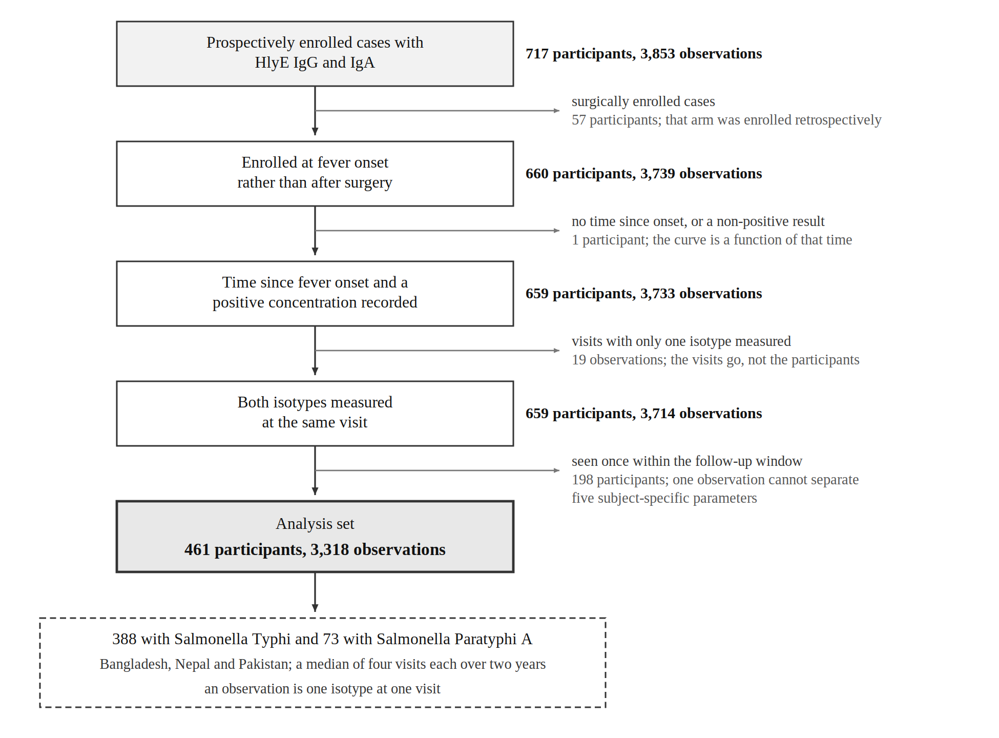
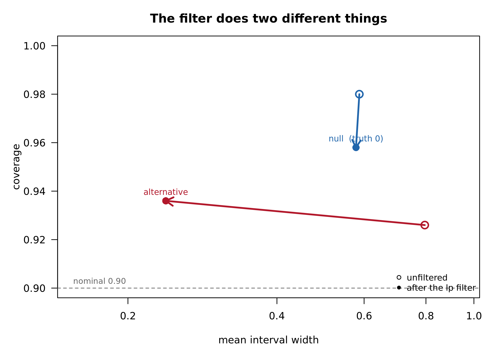

```{r}
#| label: setup-tables
#| include: false
# nolint start: line_length_linter.
#   The table chunks below hold their contents as literal character vectors, one
#   row per line. Wrapping those lines to eighty characters would split a row
#   across two lines and make the table harder to read and to edit than the long
#   line it replaces, so the line-length rule is suspended for this file. Every
#   line of actual code stays within eighty characters.
library(flextable)
library(officer)

set_flextable_defaults(font.family = "Times New Roman", font.size = 10,
                       padding.top = 2, padding.bottom = 2,
                       border.color = "black")

# Markdown emphasis sometimes survives in exported CSV headers and cells, and
# flextable renders it literally, so it is stripped on the way in.
strip_md <- function(x) {
  x <- as.character(x)
  x <- gsub("\\*\\*|__", "", x)
  x <- gsub("\\*|_", "", x)
  x <- gsub("[\r\n]+", " ", x)
  trimws(gsub(" +", " ", x))
}

thesis_ft <- function(df, widths = NULL, first_left = TRUE) {
  ft <- flextable(df)
  ft <- theme_booktabs(ft)
  ft <- fontsize(ft, size = 10, part = "all")
  ft <- bold(ft, part = "header")
  ft <- align(ft, align = "center", part = "header")
  if (ncol(df) > 1)
    ft <- align(ft, j = 2:ncol(df), align = "center", part = "body")
  if (first_left)   ft <- align(ft, j = 1, align = "left", part = "all")
  ft <- padding(ft, padding.top = 2, padding.bottom = 2, part = "all")
  ft <- valign(ft, valign = "center", part = "all")
  if (!is.null(widths)) ft <- width(ft, width = widths)
  ft <- set_table_properties(
    ft, layout = "fixed", align = "center",
    opts_word = list(split = FALSE, keep_with_next = TRUE)
  )
  ft <- hrule(ft, rule = "atleast", part = "body")
  ft <- line_spacing(ft, space = 1.15, part = "all")
  ft <- paginate(ft, group = NULL, init = TRUE, hdr_ftr = TRUE)
  ft
}
```


<!--
NO ANALYSIS IS RUN AT RENDER TIME, AND THAT IS DELIBERATE.

Every number is written out or read from a stored table, and every figure is included as a finished PNG.
The analysis lives in versioned R scripts that run on the compute server where the data are held; the bridge between the two is the CSV tables those scripts write.

Three things follow.
The manuscript renders anywhere Quarto and flextable are installed, with no access to the data and no analysis packages.
It can therefore be reviewed in a repository that must not contain participant data.
And a number in the text that disagrees with the corresponding CSV is a discrepancy someone can find, which is not true of a number a chunk computes on the fly. -->




# Abstract {.unnumbered}


Serological surveys estimate the rate of new enteric fever infections in a population from antibody concentrations measured once per participant, and they rest on a model of how those concentrations change after infection.
Current models fit each antigen–isotype combination separately, so a participant's IgG and IgA enter the estimate as though they came from unrelated people.
In practice both come from one specimen, from one person, following one infection.

Existing kinetic models assume that a participant's antibody isotypes respond independently of one another.
We relaxed that assumption by adding five cross-isotype correlations, one for each kinetic parameter, to the covariance structure of a hierarchical two-phase model, leaving every other component unchanged; setting the five to zero recovers the previous model exactly, so any difference in fit is attributable to them alone.
We fitted the model to 461 blood-culture-confirmed enteric fever cases from Bangladesh, Nepal, and Pakistan, with hemolysin E (HlyE) IgG and IgA measured at a median of four visits each over two years.

All five correlations excluded zero, with posterior medians from 0.64 to 0.84 and a smallest lower bound of 0.525.
The same association is present in the measurements themselves with no model involved, at Spearman correlations of 0.51 to 0.67 across four features that can be read directly from a participant's own series.
The estimates did not depend on where the sampler started, across a thirtyfold range of initial scales, nor on the prior scale, across a sixfold range.
A simulation study at the observed sample size confirmed that the estimator recovers a correlation that is present and does not produce one when none is there.
Out-of-sample comparison favored the correlated model at both aggregations examined.

Kinetic models fitted separately by isotype remain a reasonable description of how antibody concentrations change after infection, but a participant's two isotypes are linked at the level of the individual response, and by enough to change what the model says.
Any procedure that combines them as independent evidence will overstate the precision of what it returns.




# Introduction {#sec-ch2-intro}

Enteric fever, caused by *Salmonella enterica* serovars Typhi and Paratyphi, remains a substantial cause of illness and death in South Asia and sub-Saharan Africa, and conjugate vaccines are now recommended for introduction where the burden is high [@gbd2021typhoid; @who2019tcv].
The antibody response to infection is directed at several *S.* Typhi antigens, and immunoaffinity screening of plasma from bacteremic patients identified hemolysin E — a pore-forming toxin expressed during human infection — as the most immunoreactive of them [@charles2010hlye].
Responses to hemolysin E, particularly IgA, distinguish culture-confirmed enteric fever from other febrile illness with an area under the curve above 0.9, which is why it and its two isotypes are the biomarkers this chapter models [@andrews2019hlye].

Serological surveys can estimate how often infection occurs in a population without observing the infections themselves, by reading the antibody concentrations that past infections leave behind [@simonsen2009; @teunis2012biomarker].
What makes this possible is that antibody concentrations after infection are not static: they rise, peak, and decay along a trajectory that can be characterized in cohorts of confirmed cases, so that a single measurement taken later carries information about how long ago that person was infected [@deGraaf2014; @teunis2016].
Applied across a cross-sectional sample the method has produced incidence estimates for enteric fever, scrub typhus and other pathogens in settings where culture-based surveillance is not available [@aiemjoy2022; @aiemjoy2024scrub].

The information such methods extract depends on how much of the antibody signal they retain.
Most serological analysis dichotomizes a quantitative measurement into positive or negative against a threshold, which discards the dynamic range that carries the timing information [@arnold2019].
Methods that model the trajectory instead of thresholding it recover part of what dichotomization throws away, and the accuracy of what they recover depends on how faithfully the trajectory model describes the data it is fitted to.

## Independence of antibody isotypes in current models {#sec-ch2-gap}

Antibody responses to a single infection differ substantially between people: in how high they rise, how quickly they reach a peak, and how long they persist.
That heterogeneity has to be carried through the model rather than averaged away, because it determines how much a single measurement can say about timing [@teunis2016; @deGraaf2014].
Hierarchical within-host models do this, fitting a two-phase rise-and-decay curve with participant-specific parameters for each antigen–isotype combination [@teunis2002; @teunis2016dynamics].

What they do not do is connect the isotypes.
A participant who mounts a strong IgG response has generally mounted a strong IgA response as well, and one whose titers are still climbing in one isotype is unlikely to have finished decaying in the other.
Studies that report both isotypes describe them as moving together within individuals, though without estimating the association [@ndungo2025; @chisenga2021].
The independence assumption asserts otherwise, and this chapter measures what that costs.
Two models are contrasted throughout this chapter and the next.
The independent-antibodies model is the one that underlies current practice: episode-specific responses are taken to be uncorrelated between antigen–isotype combinations [@teunis2016].
The correlated-antibodies model is the extension developed here, which adds covariance terms linking the responses across isotypes and is otherwise identical.

The estimator treats two measurements that share an origin as two independent pieces of evidence.
Summing log-likelihoods over terms that are not independent is a composite likelihood, and its consequence is known: the estimator remains consistent while the curvature of the summed function overstates the information the data carry [@lindsay1988; @varin2011].
Parameters are therefore estimated less precisely than the data allow — and, as the seroincidence analysis of Chapter 3 shows, the incidence estimates that follow are more confident than the data justify.

There is also a substantive question underneath the statistical one.
IgA and IgG are usually read as markers of different things: IgA as an indicator of recent infection, IgG as accumulating with exposure over a lifetime [@aiemjoy2023; @aiemjoy2022repeat].
A high IgA response together with a low IgG response suggests a more recent exposure than the two elevated together.
That reading treats the two as separable signals.
If they are strongly linked at the level of the individual response, it needs qualifying — and the strength of the link is a quantity that can be estimated rather than assumed.

## What the model requires of the data {#sec-ch2-why}

The model asks each participant's data to identify their own peak height and time to peak, and specimens collected before the peak identify both.

The Seroepidemiology and Environmental Surveillance for Enteric Fever (SEES) cohorts meet this condition.
The first specimen comes at a median of six days against a population peak near 22 days, so roughly three quarters of participants contribute at least one observation before the peak, and the timing varies between individuals rather than being fixed by protocol [@aiemjoy2022].
The rise phase is observed rather than inferred, and we estimate the model on data that can support it.

## Objectives {#sec-ch2-aims}

A model that allowed every kinetic parameter to correlate with every other across isotypes would add twenty-five parameters, most of which 461 participants cannot inform.
The extension developed here is deliberately the smallest one that expresses the question: each kinetic feature is allowed to correlate with its own counterpart in the other isotype — peak with peak, decay with decay — and nothing else.
Setting those five correlations to zero returns the independent-antibodies model exactly, so any difference in fit is attributable to them and to nothing else.

We estimated the association for each kinetic parameter with credible intervals and assessed its sensitivity to the priors.
We compared the correlated model with the independent model out of sample, holding out the participant rather than the observation.
We then asked, in a simulation study, whether the estimator recovers correlations of the size observed and — equally important — whether it produces them when the truth is zero.

The simulation carries the weight.
A correlation that cannot be recovered from data simulated at that value is not a result, and one that appears when nothing is there is worse than none.
We report both.
The two models differ in one term of the covariance matrix and in nothing else.
The independent model is nested inside the correlated one at $\mathbf c=\mathbf 0$, so the question is not which description is right but whether the data contain evidence for a parameter the simpler model sets to zero — a framing that determines both the comparison (@sec-ch2-loo) and the simulation design (@sec-ch2-sim).


# Methods {#sec-ch2-methods}

## Study population and sample {#sec-ch2-data}

Participants were drawn from the SEES serological study nested within the Surveillance for Enteric Fever in Asia Project (SEAP), restricted to prospectively enrolled, blood-culture-confirmed cases in Bangladesh, Nepal and Pakistan [@aiemjoy2022].
Antibody responses to hemolysin E (HlyE) were measured for two isotypes, IgG and IgA, by enzyme-linked immunosorbent assay (ELISA) at each visit.

We applied three exclusions, each for a reason internal to the model rather than to data quality.
We excluded retrospectively enrolled participants, whose first specimen is drawn at a median of 131 days with only about 20% sampled before the population peak, so that the rise phase is unobserved and the model reaches the peak parameters only by extrapolating backward.
We excluded surgically enrolled cases on the same grounds, enrollment in that arm having been retrospective.
And we excluded participants contributing a single visit, because five subject-specific parameters cannot be identified from one observation and such participants contribute only through the population distribution.

Two further requirements are mechanical rather than substantive.
A specimen enters only if it carries a time since fever onset and a positive concentration, since the curve is a function of that time; and a visit enters only if both isotypes were measured at it, since a cross-isotype covariance is defined within a visit and not across them.
The number remaining after each step is given in @fig-ch2-flow.

::: {#fig-ch2-flow}
{width=100%}

**Participant flow.** Participants and observations remaining after each selection step, computed
from the source file rather than from the saved subset so that every intermediate count is
reproducible.
An observation is one isotype at one visit, so a visit at which both were measured
contributes two.
The largest reduction is the last and follows from the study design rather than
from attrition.
:::

The surgical arm accounts for every enrollment in this cohort that was not blood-culture-confirmed *S.* Typhi or *S.* Paratyphi A, so the second step settles the case definition as well: of the 461 participants who remain, 388 had *S.* Typhi and 73 *S.* Paratyphi A.
The last step is the largest, removing 198 participants seen once within the follow-up window.
It falls unevenly across the three sites — it removes 15% of the Nepali participants, 29% of the Bangladeshi ones, and 66% of the Pakistani ones — so it is a property of how each site's follow-up ran rather than of the antibody data, and it is the main reason Pakistan contributes 31 participants to a study its surveillance supplied 92 to.
Those removed are otherwise unremarkable: a median age of 7.0 against 8.0, 50% male against 55%, and the same median first specimen at six days.
@sec-ch2-res-pop describes what remains.

We retained observations from a suspected reinfection onward rather than excluding them.
The model describes the response to one infection, so removing them would be defensible; they are 46 of the 3,318 measurements, from 15 of the 461 participants, and we carry the reinfection flag with the analysis set so that a fit without them can be run.
Measurements below the assay's detection limit were retained at the limit value, not dropped; discarding them would remove the participants whose responses were smallest and bias the population distribution upward.

## Antibody kinetic model {#sec-ch2-curve}

The kinetic model is not new to this chapter: we used the two-phase curve of @teunis2016 and @deGraaf2014, as fitted to these biomarkers in earlier work [@lee2026shigella].
Antibody concentration for participant $i$ and antigen–isotype combination $k$ at time $t$ days after infection rises exponentially to a peak at $t_{1}$ and then decays as a power law.

$$
y_{ik}(t)=
\begin{cases}
y_{0,ik}\,\exp\!\big(\mu_{ik}\,t\big), & 0 \le t \le t_{1,ik},\\[6pt]
y_{1,ik}\Big[1+(r_{ik}-1)\,\alpha_{ik}\,y_{1,ik}^{\,r_{ik}-1}\,(t-t_{1,ik})\Big]^{-1/(r_{ik}-1)},
& t > t_{1,ik},
\end{cases}
$$ {#eq-curve}

with $\mu_{ik}=\log(y_{1,ik}/y_{0,ik})/t_{1,ik}$, so that the two branches meet at the peak by
construction.
The five participant-specific parameters are

$$
\boldsymbol\theta_{ik}=\big(y_{0,ik},\;y_{1,ik},\;t_{1,ik},\;\alpha_{ik},\;r_{ik}\big),
$$

the pre-infection concentration, the peak concentration, the time to peak, the decay rate, and the decay shape.

The exponent in the decay branch of @eq-curve is $-1/(r-1)$, not $-r/(r-1)$.
This was verified against the model file, not taken from documentation; the two forms differ materially at $r$ near 1, and the distinction matters again in the seroincidence setting, where the same curve is evaluated forward from posterior draws [@lee2026seroincidence].

Measurements enter on the log scale with a biomarker-specific precision.
For participant $i$, antigen–isotype $k$ and specimen time $t_{io}$,

$$
\log y^{\mathrm{obs}}_{iok}\;\sim\;
\mathcal N\!\Big(\log y_{ik}(t_{io}),\;\tau_k^{-1}\Big),
$$ {#eq-obs}

with the precision $\tau_k$ estimated alongside everything else.
@eq-obs is the observation model of the earlier kinetics study [@lee2026shigella], carried over unchanged.

## Hierarchical model and cross-isotype covariance {#sec-ch2-hier}

The population model is specified not on $\boldsymbol\theta_{ik}$ but on a transformed vector, and
the transformation is not a componentwise logarithm.
Two of the five are shifted first, so that the
constraints $y_1>y_0$ and $r>1$ hold by construction rather than by rejection:

$$
\boldsymbol\eta_{ik}=\Big(\log y_{0,ik},\;\log\big(y_{1,ik}-y_{0,ik}\big),\;\log t_{1,ik},\; \log k_{\mathrm{dec},ik},\;\log\big(r_{ik}-1\big)\Big)^{\!\top},
$$ {#eq-eta}

where $\log k_{\mathrm{dec}}=\log\alpha+(r-1)\log y_1$ rescales the decay rate by the peak; that substitution is the subject of @eq-kdec and the reason for it is given there.
This matters beyond bookkeeping: $\boldsymbol\Sigma$ below is the covariance of $\boldsymbol\eta$, so the correlation of @eq-rho is between these five transformed quantities and not between the raw parameters.
Stacking the two isotypes,

$$
\boldsymbol\eta_i=\big(\boldsymbol\eta_{i,\mathrm{IgG}}^{\top},\;
\boldsymbol\eta_{i,\mathrm{IgA}}^{\top}\big)^{\top}\in\mathbb R^{10},
\qquad
\boldsymbol\eta_i \sim \mathcal N_{10}\big(\boldsymbol\mu,\;\boldsymbol\Sigma\big).
$$ {#eq-sigma}

where $\boldsymbol\eta_i \in \mathbb R^{10}$ collects participant $i$'s ten transformed
parameters, $\boldsymbol\mu$ is the population mean of those ten, and $\boldsymbol\Sigma$ is their
between-participant covariance.

The two models differ in $\boldsymbol\Sigma$ and in nothing else.
The independent-antibodies model is block diagonal; the correlated-antibodies model adds a diagonal cross-block:

$$
\boldsymbol\Sigma_{\text{ch1}}= \begin{pmatrix}\boldsymbol\Sigma_G & \mathbf 0\\ \mathbf 0 & \boldsymbol\Sigma_A\end{pmatrix}, \qquad \boldsymbol\Sigma_{\text{ch2}}= \begin{pmatrix}\boldsymbol\Sigma_G & \mathbf C\\ \mathbf C^{\top} & \boldsymbol\Sigma_A\end{pmatrix}, \qquad \mathbf C=\operatorname{diag}(\mathbf c),
$$ {#eq-blocks}

with $\mathbf c=(c_{y_0},c_{y_1},c_{t_1},c_{k},c_{r})$, one for each component of @eq-eta; the fourth is on $\log k_{\mathrm{dec}}$ rather than $\log\alpha$, for the reason given in @sec-ch2-rho.
The two $5\times5$ within-isotype blocks are unchanged.
We added five parameters, not twenty-five.

A cohort of 461 participants cannot inform a full cross-block, so we restricted it to its diagonal.
A full cross-block would ask those participants to inform 25 additional covariances, most of which correspond to questions nobody has posed — whether one isotype's peak height relates to the other's time to peak.
The diagonal restriction asks only the question that motivates the chapter, which is whether a kinetic feature in one isotype travels with the same feature in the other.
It is a modeling choice.

The five correlations need no admissibility constraint, and the sampler explores them unconstrained.
We never assemble and factor $\boldsymbol\Sigma_{\text{ch2}}$; instead we build it from a Cholesky factor that is positive definite for every $\mathbf c$; the construction, and the distinction between the conditional and marginal IgA blocks that it introduces, are in @sec-appA-chol.

## Definition of the cross-isotype correlation {#sec-ch2-rho}

The reported quantity is the correlation implied by each cross-covariance:

$$
\rho_{c,j}=\frac{c_j}{\sqrt{\Sigma_{G,jj}\,\Sigma_{A,jj}}},\qquad j=1,\dots,5 ,
$$ {#eq-rho}

where $\Sigma_{G,jj}$ and $\Sigma_{A,jj}$ are the marginal between-participant variances of
@eq-blocks. Because it is computed from the assembled $\boldsymbol\Sigma$ it lies in $(-1,1)$
whatever the sampler proposes (@sec-appA-chol).

The reported correlation cannot reach one, and three arguments below turn on that ceiling.
Writing $g_j=\Sigma_{G,jj}(\boldsymbol\Sigma_G^{-1})_{jj}$, the construction of @sec-appA-chol gives

$$
\rho_{c,j}=\frac{\varrho_j}{\sqrt{1+g_j\varrho_j^{2}}} \;\xrightarrow[\ \varrho_j\to\infty\ ]{}\; \frac{1}{\sqrt{g_j}}=\sqrt{1-R_j^{2}},
$$ {#eq-ceiling}

where $\varrho_j$ is the unconstrained quantity the sampler moves in and $R_j^{2}$ is the share of the $j$-th IgG parameter explained by the other four.
The more the IgG kinetic parameters are entangled with one another, the lower the cross-isotype correlation can go — a fact about the geometry, not about the data.

The quantity reported here is a correlation between latent kinetic parameters, not between two measured concentrations.
$\rho_{c,j}$ is the correlation between a participant's latent kinetic parameters in the two isotypes — between the peak they would reach in IgG and the peak they would reach in IgA.
It is not the correlation between two observed concentrations, which additionally reflects measurement noise and the time at which each specimen happened to be drawn, and which is therefore always smaller.
Reporting the first as though it were the second would overstate what a single paired measurement tells you, and the distinction is carried into the seroincidence setting [@lee2026seroincidence].

The fourth component of @eq-eta is not $\log\alpha$, and the substitution matters because it is the scale we fit the model on rather than a presentational choice.
The decay rate $\alpha$ and the shape $r$ are weakly identified individually but their combination is not.
Define

$$
\log k_{\mathrm{dec}} = \log\alpha + (r-1)\log y_1 .
$$ {#eq-kdec}

Here $k_{\mathrm{dec}}$ is the decay rate rescaled by the peak.
It governs how fast the curve falls
immediately after $t_1$, and the data identify it even where $\alpha$ and $r$ separately are weakly
identified.

Two things follow, and they are the reason for the change of scale rather than consequences of it.
The map $(\dots,\log\alpha,\dots)\mapsto(\dots,\log k_{\mathrm{dec}},\dots)$ is triangular with unit
diagonal, so its Jacobian determinant is one and the posterior is unchanged: nothing is gained or
lost in inference, only in conditioning.
And the correlation of @eq-rho is not invariant to the choice.
On the $\log\alpha$ scale, @eq-kdec mixes the decay rate with $y_1$ and $r$, so a cross-correlation
imposed on one scale is not the cross-correlation that appears on the other; on the
$\log k_{\mathrm{dec}}$ scale the quantity imposed and the quantity estimated are the same number.
This is also why the simulation truth of @sec-ch2-sim has to be computed from the generating
distribution rather than read off the simulator's input.

We report estimates on the scale we fit the model on, which is the identified combination,
and that is a consequence of the paragraph above rather than a presentational preference.
The seroincidence analysis inverts the transformation ($\alpha=k_{\mathrm{dec}}/y_1^{\,r-1}$) when posterior draws
are converted for the incidence estimator.

## Nested model comparison {#sec-ch2-nesting}

$$
\mathbf c=\mathbf 0 \;\Longrightarrow\; \boldsymbol\Sigma_{\text{ch2}}=\boldsymbol\Sigma_{\text{ch1}} \quad\text{exactly.}
$$ {#eq-nest}

The nesting is exact, not approximate, which is what licenses attributing any difference in fit to $\mathbf c$.

## Prior specification {#sec-ch2-priors}

@sec-appA-priors gives the priors in full.
Three deserve mention here because they bear on interpretation.

**The cross-covariances.** The model samples an unconstrained $\rho_{c,j}\sim\mathcal N(0,1)$ and forms the cross-covariance as $c_j=\rho_{c,j}\,\sigma_{G,j}\,\sigma_{A\mid G,j}$, where $\sigma_{A\mid G,j}$ is the conditional scale of the IgA block; the construction of @sec-appA-chol is positive definite for every value, so the sampler truncates nothing and rejects no proposal.
The sampled $\rho_{c,j}$ is a scaling device and not the reported quantity, which is @eq-rho computed from the assembled $\boldsymbol\Sigma$.
The prior is centered at zero, so it shrinks estimates toward the null and is conservative for a chapter arguing that the correlations are non-zero.
It also has a consequence that has to be reported, not discovered: shrinkage toward zero produces over-coverage when the truth is zero and a small negative bias when it is not.
Both appear in @sec-ch2-sim and both have this explanation.

**The decay parameters.** We used a weakly informative prior, and the chapter reports it throughout.
The decay is the least well identified part of the curve, so a tighter prior would move the estimates more than a tighter prior elsewhere would; keeping it weak is the choice that lets the data speak on the parameter they speak least about.

**The between-participant scales.** These are tighter than is ideal and are a known limitation, recorded in @sec-ch2-discussion.

## Model fitting {#sec-ch2-est}

We fitted the models by Hamiltonian Monte Carlo in Stan [@stan2024].
The fitted model uses the reparameterization of @eq-kdec; the sampler computes the derived quantities so that reported estimates are on the original scale.

The sampler is not the one that study used, and the reason is a property of the prior rather than a preference.
That study placed a Wishart prior on the precision matrix of each antigen–isotype block [@jags2003].
That prior is conjugate to the multivariate normal, so Gibbs sampling handles it without gradients; Hamiltonian dynamics cannot, because the sampler would have to traverse the boundary of the positive-definite cone at every leapfrog step.

We reparameterized the prior rather than replacing it, so the correlations reported here do not follow from a change of prior.
A Wishart prior is written as a scale matrix and a degrees-of-freedom, and we carry both into the model file and moment-match them there: each scale receives a log-normal prior whose log-mean and log-standard-deviation follow from them, and each within-isotype correlation factor an LKJ prior whose shape follows from the degrees-of-freedom [@lkj2009].
The hyperparameters themselves are the `serodynamics` defaults, which were calibrated on the enteric fever cohorts this chapter uses; the earlier study used the same Wishart form with values rescaled to its own assay, so the two share a specification and not a set of numbers (@sec-appA-priors).

What the comparison in this chapter needs is narrower than that and is exact.
The two fits carry identical priors on the population means, the within-isotype blocks, and the observation precision, and differ in whether $\mathbf c$ is estimated.
No prior difference can therefore contribute to the difference between them.

Every fit reported in this chapter uses the same sampler settings: 3,000 warmup and 1,000 sampling iterations per chain, a target acceptance rate of 0.9, a maximum tree depth of 12, and no thinning.
We ran forty chains except where stated below, giving 40,000 post-warmup draws before any chain is set aside.
The tree-depth ceiling is not slack: a substantial share of transitions reaches it in some of the fits that follow, and where that happens we report it rather than absorbing it (@sec-ch2-res-init, @sec-ch2-discussion).

## The two fitted models {#sec-ch2-fits}

We fitted the model of @eq-sigma to the analysis set of @sec-ch2-data **twice**, using the block structure of @eq-blocks and the priors of @sec-ch2-priors.
The two fits differ in one argument, which decides whether the five cross-covariances $\mathbf c$ are estimated or held at zero.

The **correlated model** estimates them, as in @sec-ch2-gap; the **independent model** holds them at zero — the uncorrelated model that underlies current practice — not approximately but, by @eq-nest, exactly.

The two models share every other component of the specification, so no difference between them can arise from implementation.
That is the same argument the next chapter makes for its three likelihood forms, and it is what allows the comparison of @sec-ch2-loo to be read as a statement about $\mathbf c$ rather than about two pieces of code.

Everything reported below is one of these two objects or a replicate of the first.
We report all population-level estimates in @sec-ch2-res-main from the correlated model, and compare it with the independent model in @sec-ch2-res-loo. To assess sensitivity, we refitted the correlated model three times from wider starting values (@tbl-init), and twice more with the prior on $\rho_c$ widened to a scale of 3 and tightened to 0.5, at twenty chains rather than forty (@sec-appA-init).
The posterior draws from these two fits are also what the seroincidence analysis uses, in one case keeping each participant's two isotypes paired and in the other using draws from the model with the cross-covariances held at zero [@lee2026seroincidence].

Convergence and the filtering rule.
We ran chains from dispersed initial values.
A small minority converge to a secondary mode with substantially lower log posterior density; these are excluded by a pre-specified rule that retains chains within 100 log-density units of the best chain:

$$
\mathcal K=\Big\{\,\text{chain }m:\ \max_s \mathrm{lp}_{m,s}\;\ge\;
\max_{m'}\max_s \mathrm{lp}_{m',s}-100\,\Big\}.
$$ {#eq-lpfilter}

We carried three schemes for handling chains through together, under the names the tables give them. **Unfiltered** keeps every chain.
The **lp filter** is @eq-lpfilter. **Stacking**
assigns each chain a weight by its cross-validated predictive performance and needs no threshold at
all [@yao2022stacking], the weights being obtained by stacking the chains' leave-one-out predictive
densities.
Reporting all three makes the filter's contribution visible rather than assumed, and @sec-ch2-res-sim compares them.

**The threshold is fixed in advance and not chosen from the results.** The threshold is not an influential quantity: we report results at 50, 100 and 200 and they agree to three decimal places, so no choice within that range changes a conclusion.
It is
reported as a sensitivity rather than asserted as a constant fixed beforehand.

**Chains that fail their own diagnostics are removed by a separate rule.** Within each mode the sampler is well behaved.
The rule selects
between modes; it does not rescue a chain that failed to converge, and we report chains that fail on their own terms separately.

The minor mode is characterized, not dismissed: its landing frequency changes with
initialization while its depth does not, which is what distinguishes a genuine secondary mode
from numerical failure.
Chains that are numerically dead — log-density gaps of $10^3$ to $10^5$ —
we count separately, and they are not the same phenomenon.

**Initialization.** The filter answers one question — whether we chose the threshold to suit the answer — and leaves a different one open: whether where the sampler starts determines what it
finds.
We therefore fitted the observed data from four starting scales spanning a thirtyfold range and report all four (@tbl-init).

We ran four initialization fits and chose the primary before comparing the estimates.
We ran each of them for a stated reason and in sequence, not until one gave a preferred answer.
We ran the widest, at a starting scale of 3, specifically to test a competing explanation raised in
committee: that the rising count of minor-mode chains under wider starts might mean the minor mode
is genuinely larger, rather than that the sampler is trapping chains short of the typical set.

The primary fit was selected on retained chains and effective sample size, not on the estimate.
That distinction is only defensible because the estimates barely differ across the four; had they
differed, no choice among them would have been innocent, and the disagreement itself would have been
the result.
A reader should check @tbl-init before accepting the choice, which is why it is in
the main text rather than an appendix.

The same table settles a related mismatch.
The reported fit starts at 0.1 while the simulation
starts at 2, because the simulation must use a setting validated under the null, where the truth is
not known in advance.
The simulation therefore uses the least favorable start for convergence,
which makes the validation conservative with respect to the reported fit.

## Out-of-sample model comparison {#sec-ch2-loo}

We compared the correlated and independent models by approximate leave-one-out cross-validation [@vehtari2017].

The held-out unit is the participant, not the observation.
Leaving out a single measurement leaves
that participant's other measurements in the training set, and those carry their own kinetic
parameters, so the comparison says little about the between-participant structure that distinguishes
the two models.
Removing the participant asks the question the models actually differ on.

We report Pareto $k$ diagnostics; where they exceed 0.7 for an appreciable share of folds, we treat the comparison as indicative and use moment matching or direct refitting.

## Simulation study of estimator performance {#sec-ch2-sim}

Model comparison on the observed data cannot say whether the estimator would find a correlation
that is not there.
The simulation study asks that question directly, and it is the reason the
chapter can make a claim rather than a description.

We simulated data from the correlated model at the observed sample size under two conditions.
Because the truth
has to be a single set of numbers, the chains are filtered before it is read: we retain the 38 of 40 chains within 100 log-density units of the best (@eq-lpfilter), and the population
parameters — the means, both within-isotype blocks, and the measurement precisions — are the
posterior medians over that set, which reaches $\hat R$ of at most 1.004 and a bulk effective sample
size of at least 442.

**Filtering therefore appears twice in this study and the two uses are different.** Extracting the
truth always filters, because a truth that mixed two modes would not be a truth.
Scoring each
simulated dataset does not: we score every replicate under all three schemes of @sec-ch2-est, and
the comparison between them is one of the results.
A filtered truth and an unfiltered scoring
scheme are not in tension — the first defines what is to be recovered, the second asks how well each scheme recovers it.

The two conditions are:

```{r}
#| label: tbl-sim
#| echo: false
#| tbl-cap: |
#|   **The two simulation conditions.** Both take every population parameter from the same
#|   correlated-model fit and differ in the cross-block alone: the null sets it to zero,
#|   and the alternative takes it from that fit's posterior. Each generates 100 datasets at the
#|   observed sample size. The truth against which each is scored is the marginal correlation
#|   read off the assembled covariance matrix, not the value handed to the simulator, because
#|   the two are not the same number once the cross-covariances come from a fit.
d <- as.data.frame(do.call(rbind, list(
  c("Null", "c = 0, everything else from the correlated fit", "0, 0, 0, 0, 0", "Does the estimator produce correlation when none is present?"),
  c("Alternative", "c from the correlated fit's posterior", "0.841, 0.645, 0.857, 0.671, 0.658", "Does the estimator recover correlation?")
)), stringsAsFactors = FALSE)
names(d) <- c("Condition", "How the truth is built", "Marginal correlations", "Question")
thesis_ft(d, widths = c(0.83, 1.72, 1.78, 2.07))
```

The null condition comes from the correlated fit with the cross-covariances set to zero, **not from refitting the independent model**. Refitting would produce its own population means, within-isotype blocks and measurement precisions, so a comparison against it would confound the cross-covariances with those differences.
We built the null from the correlated model with $\mathbf c$ set to zero, which leaves one thing different between the null and the alternative and nothing else.
The seroincidence analysis makes the same move for the same reason when it breaks the isotype pairing by reordering rows rather than by refitting [@lee2026seroincidence].

We computed the truth rather than assuming it, and computed it exactly rather than approximating it.
Once
$\mathbf c$ is taken from a fit, its five entries no longer share a single scalar, so the closed form
of @eq-ceiling no longer applies and the marginal correlations are read directly off the assembled
$\boldsymbol\Sigma$. We scored each replicate against those values rather than the ones handed to the simulator.

We report four quantities for each parameter, following @morris2019: bias, mean squared error,
posterior variance and coverage — for the model parameters, not for prediction error.
We report each with a Monte Carlo standard error (MCSE).

We fixed the decision rule in advance.
We judged coverage of a nominal 90% interval against $0.90$, using twice the MCSE.
A departure smaller than 2 MCSE is not called; one larger is, in whichever direction it
falls.
We recorded the rule before running the conditions, and we report it as failing where it fails
— including the direction in which it fails, which is over-coverage and has the prior-shrinkage
explanation given in @sec-ch2-priors.

We examined large-sample behavior before small-sample behavior.
A method is evaluated on both,
and reporting only the sample size in hand leaves open whether an observed shortfall is a property of
the estimator or of the data.
Where the large-sample condition could not be run, the obstacle is stated with the evidence for it, not left implicit (@sec-ch2-discussion).

## Sensitivity analyses {#sec-ch2-sens}

Each sensitivity analysis varies one thing and tests one stated thing (@tbl-ch2-sens).

```{r}
#| label: tbl-ch2-sens
#| echo: false
#| tbl-cap: |
#|   **Sensitivity analyses.** Each row varies one thing and leaves the
#|   rest of the model untouched, so that any change in the estimates is attributable to that
#|   row alone. The three address whether the reported correlations are a product of the
#|   prior, the sampler, or the chain-filtering rule.
d <- as.data.frame(do.call(rbind, list(
  c("Prior on ρ_c", "scale of the normal prior", "whether the estimates are prior-driven"),
  c("Filter threshold", "50 / 100 / 200 log-density units", "whether the filter drives the result"),
  c("Initial values", "three dispersed scales", "minor-mode landing frequency and depth")
)), stringsAsFactors = FALSE)
names(d) <- c("analysis", "What is varied", "What it tests")
thesis_ft(d, widths = c(0.95, 1.85, 3.60))
```

# Ethical approval {.unnumbered}

This study was approved by the institutional review boards of the Centers for
Disease Control and Prevention, Stanford University (39557), and MassGeneral Brigham (2014P002602,
2019P000152, 2013P001965, 2016P000949) in the USA; the Bangladesh Institute of Child Health Ethical
Review Committee (01-02-2019); the Nepal Health Research Council Ethical Review Board (391/2018);
and the AKU Ethical Review Committee (2019-0410-4188) and the Pakistan National Bioethics Committee
(4-87/NBC-341-Amend-revised/19/81) in Pakistan.
Written informed consent was obtained from all
participants and from the parents or guardians of participants younger than 18 years at enrollment,
with written assent obtained from children aged 15--17 years.
This secondary analysis used
de-identified antibody measurements collected under the original consent and did not require
additional consent or a waiver.

# Results {#sec-ch2-results}

## Study sample characteristics {#sec-ch2-res-pop}

The 461 participants contributed 3,318 measurements at 1,659 visits, a median of four visits each,
with the last specimen at a median of 463 days after fever onset.
Their median age at the first
specimen was 8.0 years and 55% were male.
The first specimen came at a median of six days, and 76%
of participants were sampled before day 22, the approximate population peak; that fraction is what
makes the peak height and the time to peak quantities these data observe rather than quantities
reached by extrapolation (@sec-ch2-why).
Concentrations at the assay's detection limit are rare here, 34 of 3,318
measurements, so the censoring convention has little to act on (@tbl-ch2-pop).
The series themselves appear in @fig-ch2-raw.

::: {#fig-ch2-raw}
{width=100%}

**Raw longitudinal HlyE IgG and IgA responses, all 461 participants.** Each line is one
participant and points mark specimen collections; concentrations are on a log scale.
The dashed line
marks day 22, the approximate population time to peak.
Most participants contribute a specimen
before it, which is the condition the model of @sec-ch2-hier needs (@sec-ch2-why); the between-participant spread visible at every time is what
the hierarchical parameters carry.
:::

```{r}
#| label: tbl-ch2-pop
#| echo: false
#| tbl-cap: |
#|   **Characteristics of the longitudinal analysis set.** Participant, visit, and specimen
#|   characteristics for the 461 blood-culture-confirmed enteric fever cases, shown overall
#|   and by country. Continuous quantities are median (Q1--Q3); counts are n (%). Age is
#|   taken at the first specimen. Days are measured from fever onset, and day 22 is the
#|   approximate population time to peak for HlyE, used here only to describe how much of
#|   the rise phase each country's schedule observes. An observation is one isotype at one
#|   visit.
d <- read.csv("tab/ch2_table1.csv", check.names = FALSE, fileEncoding = "UTF-8")
thesis_ft(d, widths = c(1.90, 1.15, 1.15, 1.10, 1.10))
```

The three countries are not interchangeable, which is why @tbl-ch2-pop stratifies by them.
Bangladesh contributes children, at a median age of 5.4 years with one participant aged 16 or over;
Nepal contributes adults, at a median of 20.6 years with 72% aged 16 or over.
Age and country are
therefore close to the same variable in this cohort.
Earlier work on these cohorts fitted kinetics
in three age strata [@aiemjoy2022]; doing so here would estimate each stratum's five correlations
almost entirely within one country, and the chapter fits a single pooled model instead.
The
schedules differ as well: every Bangladeshi participant was sampled before day 22, against a third
of the Nepali ones, whose first specimen came at a median of 32 days.
What follows is therefore
pooled over three populations that differ both in age and in how much of the rise phase their
schedules observed, and we report one set of estimates.

## The five cross-isotype correlations {#sec-ch2-res-main}

The correlations are read off a fitted model, so the first thing to establish is that the model
describes these data.
The fitted population trajectory tracks the observations across both isotypes (@fig-ch2-fit).

::: {#fig-ch2-fit}
{width=100%}

**The fitted population trajectory over the raw data.** The line is the median curve for a new
participant drawn from the fitted population distribution and the band is its 90% interval; the gray
lines are the observed series.
Both axes are on a log scale, which is where the two-phase form of
@eq-curve is a rise and a decay meeting at a corner.
The rise, the corner, and the slower decay of
IgG are all present in the observations, and the band covers the spread between participants without
being so wide as to be uninformative.
The population means behind these curves are of the same order
as those reported for these cohorts under an age-stratified fit [@aiemjoy2022], which is the closest
external comparison available; the two are not directly comparable, because that analysis stratified
by age and this one pools (@sec-ch2-data).
:::

```{r}
#| label: tbl-rho
#| echo: false
#| tbl-cap: |
#|   **Cross-isotype correlations, 461 participants.** Posterior medians and 90% credible
#|   intervals for the five same-parameter correlations between IgG and IgA, from the primary
#|   fit after the log-density chain filter. These are correlations between a participant's
#|   latent kinetic parameters, not between their observed concentrations. Convergence
#|   diagnostics are given for each; bulk effective sample size is from the 38 retained
#|   chains.
d <- as.data.frame(do.call(rbind, list(
  c("baseline", "0.831", "(0.777, 0.880)", "1.000", "926"),
  c("peak", "0.639", "(0.531, 0.728)", "1.001", "589"),
  c("peak-time", "0.840", "(0.732, 0.909)", "1.004", "450"),
  c("decay-rate", "0.653", "(0.525, 0.762)", "1.002", "442"),
  c("decay-shape", "0.643", "(0.529, 0.745)", "1.001", "565")
)), stringsAsFactors = FALSE)
names(d) <- c("parameter", "median", "90% credible interval", "R-hat", "bulk ESS")
thesis_ft(d, widths = c(1.38, 0.75, 2.64, 0.63, 1.0))
```

All five correlations exclude zero, and not marginally: the smallest lower bound is 0.525.
A
participant who mounts a high peak in IgG mounts a high peak in IgA; one whose response takes longer
to reach its peak in one isotype takes longer in the other; and the same holds for the pre-infection
level and for both decay parameters.

::: {#fig-ch2-pairs}
{width=100%}

Posterior mean of each participant's IgG kinetic parameter against the same parameter for IgA, one
point per participant, with the model's $\rho_c$ annotated and the line $y=x$. Posterior means are
shrunk toward one another through the correlation being estimated, so the Pearson correlations of
the points — 0.93, 0.76, 0.88, 0.75, and 0.79 — each exceed the fitted $\rho_c$; @sec-ch2-discussion
takes up what the panel does and does not establish.
:::

The two largest associations are the pre-infection level (0.831) and the time to peak (0.840);
@sec-ch2-discussion returns to both.

The same association is present in the measurements themselves, with no model involved.
Four of
the five kinetic features have a counterpart that can be read straight off a participant's own
series: the smallest concentration observed stands for the pre-infection level, the largest for the
peak, the day on which that largest value was seen for the time to peak, and the slope of log
concentration from there to the last visit for the decay rate.
The fifth, the decay shape, has no
such counterpart.
Correlating each of the four between the isotypes across all 461 participants
gives Spearman coefficients of +0.67, +0.58, +0.51 and +0.65.
These are uniformly smaller than the
parameter correlations above, as one would expect of quantities measured with noise at a handful of
visits, and they establish that the association is in the data and not only in the model.

## Sensitivity to initialization and prior scale {#sec-ch2-res-init}

```{r}
#| label: tbl-init
#| echo: false
#| tbl-cap: |
#|   **Initialization sensitivity, observed data, after filtering.** The model was fitted
#|   four times from starting values dispersed over a thirtyfold range, and all four are
#|   reported. Chains retained is the number surviving the log-density filter out of 40. The
#|   baseline correlation is shown because it is the parameter the initialization
#|   comparison turns on; per-parameter estimates for all five are in @sec-appA-init.
# Rows are identified by starting scale, which is the quantity that varies.
d <- as.data.frame(do.call(rbind, list(
  c("0.1 (primary)", "38 / 40", "0.831", "442", "1.004", "4"),
  c("0.5", "32 / 40", "0.826", "196", "1.005", "3"),
  c("2", "24 / 40", "0.829", "214", "1.001", "245"),
  c("3", "9 / 40", "0.831", "84", "1.006", "4,039")
)), stringsAsFactors = FALSE)
names(d) <- c("starting scale", "chains retained", "baseline correlation", "min ESS", "max R-hat", "divergences")
thesis_ft(d, widths = c(1.40, 1.25, 1.60, 0.68, 0.72, 0.75))
```

Across a thirtyfold range of starting scales the posterior medians agree to within 0.005 for the
baseline correlation and 0.016 for the widest-ranging of the five.
What changes is how many chains
reach the typical set, and through that the effective sample size.
The estimate does not change.

That separation licenses the choice of primary fit.
It was made on retained chains and effective
sample size (@sec-ch2-fits), and because the estimates agree, that criterion could not have
selected a preferred answer.

The widest start answers a competing explanation.
A wider start sends more chains to the minor mode.
Two readings are available: the minor mode is
genuinely substantial and narrow starts were missing it, or wide starts strand chains short of the
typical set.
The fit at a starting scale of 3 distinguishes them.

It does not converge.
Thirty-one of forty chains fail: 4,039 divergent transitions, 87% of
transitions at the tree-depth ceiling, and ten chains with low energy Bayesian fraction of missing
information.
Pooled without filtering, those forty chains give a baseline correlation of 0.052.

The nine chains that do arrive give 0.831 — the primary estimate, to three decimals, from nine
chains rather than thirty-eight.

A genuinely larger minor mode would have been found and sampled by the wider start.
Instead the
wider start breaks the sampler, and what survives reproduces the answer exactly.
That is evidence for trapping, not for a substantial second mode, and it places an upper bound on how wide a
starting scale is usable.

A second axis is available and answers a different question.
Because we sample $\rho_c$
unconstrained (@sec-ch2-priors), the reported correlations could in principle come
from the prior centered at zero rather than from the data — and the two largest of them, the baseline and the
time to peak, correspond to values of $\rho_c$ that sit more than one and a half standard deviations
outside it.
The prior-sensitivity fits answer that directly: the same model and data with the prior scale widened to 3 and tightened to 0.5, a sixfold range, at twenty chains rather than forty.

The estimates barely move.
The baseline correlation is 0.840 under the wide prior and 0.816 under
the tight one, against 0.831 in the primary fit, and across all five parameters the movement is 0.020 to 0.090 (@sec-appA-init).
Every one of those is smaller than the seed-to-seed spread of a
single fit in the simulation study, so **the correlations are determined by the data and not by the
prior**, despite the parameter being unbounded.
The prediction recorded before these fits were run
was a movement of about 0.19 in the baseline; the observed 0.024 is eight times smaller, and the
direction was right where the magnitude was not.

The largest movement on the prior axis, 0.090 for the time to peak, is nonetheless larger than Monte Carlo error can account for, and @sec-ch2-res-weak takes that parameter up separately.

## Recovery of the correlations under simulation {#sec-ch2-res-sim}

We evaluated coverage, bias, and interval width under both conditions and all three chain-handling schemes (@tbl-ch2-cov).

```{r}
#| label: tbl-ch2-cov
#| echo: false
#| tbl-cap: |
#|   **Coverage of a nominal 90% interval, 100 seeds per condition, five parameters each.** Each
#|   row pools 500 intervals. Three chain-handling schemes are compared: no filtering, the
#|   log-density filter of @eq-lpfilter, and stacking weights, which has no threshold. Mean
#|   width and mean bias are over the same intervals, and bias is measured against the truth
#|   of that condition.
d <- read.csv("tab/table2_coverage.csv", fileEncoding = "UTF-8")
d$grid   <- ifelse(d$grid == "null", "null (c = 0)", "correlation present")
d$scheme <- c(all = "unfiltered", lp = "lp filter",
              stacking = "stacking")[d$scheme]
d <- d[order(match(d$grid, c("null (c = 0)", "correlation present")),
             match(d$scheme, c("unfiltered", "lp filter", "stacking"))), ]
d$grid[duplicated(d$grid)] <- ""
out <- data.frame(
  condition = d$grid, scheme = d$scheme,
  intervals = format(d$n_int, big.mark = ","),
  coverage  = sprintf("%.3f", d$coverage),
  MCSE      = sprintf("%.3f", d$mcse),
  `mean width` = sprintf("%.3f", d$width),
  `mean bias`  = sprintf("%+.3f", d$bias),
  check.names = FALSE)
thesis_ft(out, widths = c(1.28, 0.95, 0.81, 0.85, 0.71, 0.95, 0.85))
```
::: {#fig-ch2-cov}
{width=100%}

Coverage of a nominal 90% interval for each of the five correlations, under the null (left) and under the alternative (right), for the three chain-handling schemes.
Bars are Monte Carlo standard errors;
the dashed line is nominal.
This panel keeps the five parameters apart rather than pooling them into one
number per condition and scheme (@tbl-ch2-cov). That separation is what makes
the two extremes of @tbl-ch2-perparam visible.
:::

The estimator recovered the correlations that were present and produced none where there were none.
Simulating with all five cross-covariances at zero gave a mean bias of +0.008 to +0.010 against a truth of zero, with every interval containing zero; simulating under the alternative, against true values of 0.841, 0.645, 0.857, 0.671, and 0.658, gave a mean bias after filtering of −0.027.

The pre-specified decision rule was not met in any of the six condition-by-scheme combinations (@sec-ch2-sim), and every
departure is in the same direction: coverage above nominal, from 0.926 to 0.980.

Two parameters sit at the extremes of @fig-ch2-cov. Time to peak is the only one falling below nominal under the alternative, at 0.860, and decay shape reaches 1.000 under all three schemes.
The three schemes differ by at most 0.010 for any parameter.

### Sources of over-coverage {#sec-ch2-res-two}

::: {#fig-ch2-filter}
{width=85%}

Mean interval width against coverage, before and after the log-density filter.
Each arrow runs from
the unfiltered value to the filtered one; the dashed line is nominal 0.90.
:::

The two conditions move in different directions.
Under the null, coverage falls from 0.980 to 0.958
while the width changes by two per cent.
Under the alternative, the width falls by seventy per cent,
coverage rises from 0.926 to 0.936, and the bias halves from −0.053 to −0.027.
@sec-ch2-discussion takes up what each direction indicates.

The filter is not a tuned quantity.
Recomputed from the cached fits at thresholds of 50, 100 and
200, coverage is identical to three decimal places under both conditions — 0.958 and 0.936 — and stacking,
which has no threshold at all, agrees to within 0.004.
The quantity the filter selects on is
therefore not sensitive to where the line is drawn.

## Parameter-specific recovery {#sec-ch2-res-weak}

```{r}
#| label: tbl-ch2-perparam
#| echo: false
#| tbl-cap: |
#|   **Per-parameter performance under the alternative, after filtering, 100 intervals
#|   each.** The pooled coverage above averages over real heterogeneity between parameters,
#|   and two sit at the extremes: time to peak is the only parameter falling below nominal,
#|   and decay shape reaches 1.000 while holding the third smallest mean squared error. Bias
#|   is the mean posterior median minus the truth, and the posterior variance is the average
#|   over replicates of the variance implied by the interval.
d <- as.data.frame(do.call(rbind, list(
  c("baseline", "0.940", "−0.018", "0.0011", "0.0054"),
  c("peak", "0.960", "−0.015", "0.0020", "0.0030"),
  c("peak-time", "0.860", "−0.056", "0.0049", "0.0204"),
  c("decay-rate", "0.920", "−0.063", "0.0080", "0.0094"),
  c("decay-shape", "1.000", "+0.016", "0.0023", "0.0056")
)), stringsAsFactors = FALSE)
names(d) <- c("parameter", "coverage", "bias", "MSE", "posterior variance")
thesis_ft(d, widths = c(1.44, 1.02, 0.92, 0.92, 2.10))
```

The pooled figure of 0.936 averages over real heterogeneity.
Two parameters sit at the extremes
and each is informative.

Decay-shape covers 1.000 with the third smallest mean squared error.
Accurate point estimate,
interval far wider than it needs to be: the cleanest possible form of over-coverage.

Time to peak is the weakest parameter on every measure.
It has the lowest coverage of the five
at 0.860, the second-largest bias, and — separately — the largest movement across prior scales in @sec-ch2-res-init, at 0.090.

The posterior-variance column identifies which of the two failures it is.
Its posterior variance is
the largest of the five and four times its mean squared error, so the interval is not too short; it
is the only parameter whose coverage falls below nominal while carrying an interval that wide, and
what puts the truth outside it is the bias of −0.056 rather than the width.
That is the same distinction the seroincidence analysis draws for the incidence interval [@lee2026seroincidence], arrived at here from
the opposite direction.
Given a posterior standard deviation of 0.054 and bulk effective sample sizes of 45 and 76 in the prior-sensitivity fits, that difference is seven standard errors and so is not Monte
Carlo noise.

## Out-of-sample predictive comparison {#sec-ch2-res-loo}

The credible intervals establish that the parameters are non-zero.
Whether the richer model
predicts better is a separate question, and one a reader indifferent to covariance structure will
ask.
Two comparisons bear on it and a third quantity is available without approximation.

```{r}
#| label: tbl-ch2-loo
#| echo: false
#| tbl-cap: |
#|   **Leave-one-out comparison at two aggregations.** We compared the correlated and independent models by approximate leave-one-out cross-validation, and
#|   the last two columns give the Pareto diagnostic for each. Single
#|   measurements are held out first and then whole participants. The second is the comparison the models
#|   actually differ on, and it is the one the importance-sampling approximation could not
#|   deliver: the Pareto diagnostic exceeded 0.7 in every fold, so that row is reported as an
#|   attempt rather than an estimate.
# Values are literal: the participant row is not in tab/table9_loo.csv, so this
# table cannot be built from the file.
out <- data.frame(
  `held-out unit` = c("observation (n = 3,318)", "participant (n = 461)"),
  `correlated model` = c("\u22123296.2", "\u22123339.9"), `independent model` = c("\u22123636.9", "\u22123614.7"),
  difference = c("340.7", "274.8"),
  SE = c("44.1", "33.5"),
  `Pareto k > 0.7, correlated` = c("20%", "100%"),
  `Pareto k > 0.7, independent` = c("27%", "100%"),
  check.names = FALSE)
thesis_ft(out, widths = c(1.76, 0.85, 0.85, 0.81, 0.55, 1.07, 0.51))
```
Leaving out one measurement at a time, the correlated model scores 340.7 log units higher (SE
44.1), which is 7.7 standard errors.
Divided across 3,318 measurements that is 0.103 log units
each, or about eleven per cent more predictive density per measurement.
The Pareto diagnostic
exceeded 0.7 for 20% of folds in the correlated model and 27% in the independent one, so the comparison is indicative, not exact [@vehtari2024psis].

The more relevant comparison is the one the approximation cannot be trusted on.
Leaving out a whole participant is the comparison that matches the question, because what
separates the two models is the structure *between* participants (@sec-ch2-loo).
Removing one
measurement leaves that person's other six, and the model can predict the missing one through the
correlation from the other isotype — a real question, but not the one the two models were built to
differ on.

It returns a number, and the diagnostic that says whether to believe it fails.
Removing a
participant removes every observation informing their ten kinetic parameters, so the posterior for
those parameters reverts most of the way to the prior.
The importance-sampling approximation assumes
the leave-one-out posterior is close to the full one, and here it is not.
The Pareto diagnostic exceeded 0.7 for 461 of 461 folds in the correlated model and
460 of 461 in the independent one, and the estimated effective number of parameters was 1,416 —
about three per participant, against ten latent parameters per participant in the model.

The number is therefore reported as attempted, not as an estimate.
The remedy is $K$-fold
cross-validation, which refits instead of reweighting and so avoids the failure entirely; at ten folds
that is ten refits of a model that takes hours, which places it outside the present work rather than outside reach.

The most informative comparison is unavailable for exactly the reason that makes it informative.

A third quantity depends on no approximation at all.
Since $p_{\text{loo}}$ is defined as the
difference between the in-sample and leave-one-out scores, the in-sample log predictive density can
be recovered from the two quantities already computed:

$$
\mathrm{lpd} = \widehat{\mathrm{elpd}}_{\mathrm{loo}} + p_{\mathrm{loo}}.
$$ {#eq-lpd}

where $\mathrm{lpd}$ is the in-sample log predictive density, $\widehat{\mathrm{elpd}}_{\mathrm{loo}}$ the leave-one-out estimate of expected log predictive density, and $p_{\mathrm{loo}}$ the estimated effective number of parameters.

It differs between the models by 189.0 log units at the observation aggregation and 189.6 at the participant aggregation — agreement to within 0.6, as it must be, since the in-sample fit does not depend on how we group the folds.
Five additional parameters bought 189 log units of in-sample fit, against the 5 that Akaike's criterion would charge and roughly 15 for Schwarz's.

In-sample fit favors richer models by construction, so this is not cross-validation evidence and is not offered as such.
It is reported because it is exact, it agrees in direction with the observation-level comparison, and together the three quantities point the same way while only one of them rests on importance sampling.

# Discussion {#sec-ch2-discussion}

A participant's two antibody isotypes do not respond independently.
All five kinetic parameters — the pre-infection level, the peak, the time to peak, and both decay parameters — correlate across IgG and IgA, with posterior medians between 0.64 and 0.84 and lower credible bounds no smaller than 0.525.

This is estimated with the smallest extension that can express it: five parameters, one per kinetic feature, with the two within-isotype blocks left exactly as the earlier study had them.
Setting them to zero returns the previous model identically (@eq-nest), so the comparison attributes any difference to those five and to nothing else.

The pairwise scatter of @fig-ch2-pairs is not independent evidence that the correlations are real, because it is persuasive in a way the numbers behind it do not support.

A participant's IgA posterior mean is shrunk toward what their IgG implies, through the correlation being estimated.
The points are therefore more correlated than the underlying parameters, not less: every panel's correlation exceeds the corresponding $\rho_c$ (@fig-ch2-pairs).
A figure drawn from a model cannot test that model.

What it does show is the pairing the fitted model carries, which is what the seroincidence analysis draws from when it pairs parameter draws within a simulated participant.
We include it for that reason.

The association is established by the rank correlations computed without a model, which @sec-ch2-res-main reports alongside the main results because they are evidence rather than commentary. **Those four Spearman coefficients use no model at all**, and they are what the figure cannot do: they carry the claim, while @fig-ch2-pairs carries the intuition.

The pre-specified rule was not met in any of the six combinations.
Every departure in those six was above nominal.

The two arrows of @fig-ch2-filter show this is not one phenomenon but two, and the filter is what separates them.
The direction each arrow points is the diagnostic: a vertical move means the filter removed chains without removing width, and a horizontal one means the width itself was what the filter took away.

$$
\underbrace{\text{null: the prior}}_{\text{cannot be filtered away}}
\qquad
\underbrace{\text{alternative: multimodality}}_{\text{the filter removes it}}
$$

Over-coverage under the null comes from the prior, and no post-processing can remove it.
$\rho_c \sim \mathcal N(0,1)$ centered at zero is the conservative choice for a chapter arguing that these correlations are non-zero, and its cost is that intervals cover 0.958 rather than 0.90 when the truth is zero.
That the filter changes the width by only two per cent is what identifies the prior, not multimodality, as the source.
Reporting a conservative interval as though it were exact would be the error; having a conservative interval is not.

Under the alternative the filter removes the over-coverage almost entirely, and the mechanism is visible in the widths: seventy per cent of the unfiltered width was chains in a secondary mode contributing tails that carry no information.
The first is the price of a prior centered at the null; the second is the reason the filter exists.

Widening the prior would reduce the over-coverage.
It would also weaken the chapter's own claim, since a prior centered at zero makes non-zero correlations harder to find rather than easier.
We retained the conservative choice and state its cost.

Filtering chains by log density invites the obvious objection: that it is selecting the answer.
Four things bear against it, and the fourth is the strongest.

Coverage is identical to three decimals across the range of thresholds examined (@sec-ch2-res-two), so no value in it could have suited the answer.
Stacking, which has no threshold at all, reaches the same place by different machinery [@yao2022stacking].
Within each mode the sampler is well behaved, so the rule selects between modes; it does not repair convergence.

And the fit at a starting scale of 3 shows what the filter is actually doing.
Most of its chains never reach the typical set and drag the unfiltered figure far below every other fit; the few that arrive return the primary estimate exactly (@sec-ch2-res-init).
The filter recovered the same answer from a quarter of the chains, which is what a rule that separates arrival from non-arrival should do, and not what a rule selecting a preferred answer would do.

Importance sampling cannot deliver the comparison that matches the question, which is holding out a whole participant, and the reason is structural, not incidental.
Removing a participant removes all the data on their ten kinetic parameters, so the leave-one-out posterior is nowhere near the full-data posterior, and reweighting the draws one already has cannot approximate it [@vehtari2024psis].
The diagnostic failed for every fold.

This is a known difficulty with group-level cross-validation in hierarchical models [@merkle2019], not a peculiarity of this analysis, and the standard remedy is to refit, not reweight.

What can be said is that three quantities point the same way and only one of them uses importance sampling: the observation-level comparison, the in-sample difference of @eq-lpd, and the five credible intervals themselves.
The chapter's claim rests on the third.

This is the second pre-specified check to fail.
The cluster-robust standard error in the seroincidence analysis was predicted to exceed one and did not [@lee2026seroincidence]; the participant-level comparison here was expected to be the primary evidence for the extension.
It returns a difference of 274.8 log units, in the same direction as everything else, but the importance-sampling diagnostic failed in every one of its 461 folds, so that number cannot be relied on (@tbl-ch2-loo).
We report both as failures.
Pre-specifying the checks and reporting those that did not behave as predicted lets a reader judge whether the checks could have failed.

Three separate signals identify the same parameter as the difficult one, and they arrive from different parts of the analysis.
It has the lowest coverage of the five under the alternative (@tbl-ch2-perparam); it shows the largest disagreement across prior scales, and by a margin too wide for Monte Carlo error to explain (@sec-ch2-res-init); and it is the parameter whose correlation is largest in the observed data (@tbl-rho).

Its posterior variance says which of the two kinds of failure this is.
That variance is four times the mean squared error, so the interval is not too short; what puts the truth outside it is the bias of $-0.056$.
The distinction is the one the seroincidence analysis draws for the incidence interval [@lee2026seroincidence], reached here from the opposite direction — there an interval was too narrow and correctly centered, here it is wide enough and off-center.
Something about the time to peak is harder than the rest, and the same parameter recurs below for an unrelated reason.

A large correlation that is hard to estimate is not a contradiction.
The time to peak is identified by observations taken before the peak, and although the SEES design supplies them for roughly three quarters of participants (@sec-ch2-why), it supplies few per person.
The parameter is strongly correlated across isotypes and weakly identified within them, and the second property is what the coverage and the replicate spread are measuring.

The two largest correlations here are the pre-infection level and the time to peak, and neither of these enters the seroincidence analysis.
The seroincidence likelihood uses the decay phase only, parameterized by the peak, the decay rate, and the decay shape, with time measured from the peak [@lee2026seroincidence] — so the two strongest associations this chapter reports are structurally absent from the chapter that applies it.

That is not a defect in either chapter; it is a fact about the estimator, and it predicts what the seroincidence analysis finds.
There, pairing the parameter draws accounts for about a quarter of the widening, with the larger part following from a participant having a single infection time.
A chapter whose two strongest results cannot reach the application should not expect to dominate it, and it does not.

The five correlations are real, large, and recovered by an estimator that does not produce them when none is present.
The intervals around them are conservative, for a reason that is understood and quantified.
The extension earns its five parameters.

The association reported here is a property of the fitted model.
Whether it is useful is a separate question, and this chapter does not answer it.

The seroincidence analysis asks it at the population level and finds that the pairing accounts for roughly a quarter of the correction it reports, with the larger part following from a participant having a single infection time [@lee2026seroincidence].

We designed a second and more direct test, which is not part of this dissertation.
For a participant in the case cohort the time since fever onset is known.
That information can be held out and each model asked to recover it from a single specimen, in three variants that separate the same two assumptions the seroincidence analysis separates: one biomarker alone; two biomarkers under a single shared infection time with independent kinetic parameters; and two with the parameters paired.

The prediction, recorded before the analysis is run, is that the ordering will match that of the seroincidence analysis — the larger improvement from using two biomarkers under one infection time, a smaller further improvement from pairing them.
The reasoning is that the two decompositions are the same partition of the same assumption, expressed in days rather than in interval width.

If instead the pairing supplies most of the individual-level gain, the two measurements disagree, and the attribution in the seroincidence analysis would have to be revisited before we can rely on either.
We record that outcome here as a possibility rather than dismissing it.

The analysis is planned for the accompanying manuscript rather than for this dissertation, where the correlated model can be refitted with each participant held out.

The results should be considered in light of the following limitations.
The prior on the between-participant scales is tighter than would be ideal, and the intervals reported are conservative in consequence; the direction of that conservatism is understood, since a prior centered at zero makes non-zero correlations harder to find rather than easier, and so works against this chapter's own conclusion rather than for it.
The cross-block is restricted to its diagonal on the argument that a cohort of this size cannot inform twenty-five cross-parameter covariances and that those covariances answer questions nobody has posed (@sec-ch2-hier); that argument is stated rather than demonstrated, and demonstrating it would require either a larger cohort or a simulation designed for the purpose.
We evaluated coverage at one sample size under two truth vectors, which establishes that the estimator is calibrated where we use it but not that it remains so as the sample grows.
The tree-depth ceiling binds under the alternative, and whether raising it removes the multimodality or only the saturation is not established.
The model describes the response to one infection, and fifteen participants contribute measurements from a suspected reinfection onward, 46 of the 3,318, which were retained rather than dropped; whether removing them moves the five correlations is not tested here.
Age and country are nearly the same variable in this cohort — Bangladesh contributes children and Nepal adults (@sec-ch2-res-pop) — so a single pooled fit is the only one these data support, and neither the effect of age nor the effect of setting can be separated from the other without a design that varies one at a time.
Clinical covariates were not examined for the same reason and one more: whether the strength of these correlations varies with severity, age, or prior exposure is a question the SEES design could address and this analysis does not.

A participant's antibody isotypes have been treated as independent in the models that underpin current seroincidence estimation, and this chapter shows that they are not.
The five correlations reported here are the smallest set of parameters that expresses the departure, and they are recovered by an estimator that does not produce them when the truth is zero.
Two extensions follow directly.
The model comparison needs $K$-fold cross-validation, since the comparison that matches the question — holding out a whole participant — cannot be done by importance sampling here and $K$-fold refits rather than reweights; at ten folds it is ten fits of a model that takes hours, which places it beyond the present work rather than beyond reach.
And individual infection times are the natural next analysis, with the prediction recorded above so that either outcome is informative: if the correlated model recovers a participant's infection time more precisely than the independent one, that is a second and independent measurement of the decomposition the seroincidence analysis reports, and if it does not, that chapter's attribution needs revisiting.

# Funding {.unnumbered}

This research was supported by the Bill & Melinda Gates Foundation, which funded the Surveillance for Enteric Fever in Asia Project (INV-008335) and the ancillary serological study from which these data are drawn (INV-000572).
The funders had no role in study design, data collection, data analysis, data interpretation, or the writing of this report.



# Supporting material

## Construction of the covariance and positive definiteness {#sec-appA-chol}

A Kronecker factorization would constrain $\mathbf c$ in a way the data cannot justify.
Writing $\boldsymbol\Sigma_{\text{ch2}}$ as in @eq-blocks and factoring it requires, by the Schur complement, the $10\times10$ matrix is positive definite if and only if

$$
\boldsymbol\Sigma_A-\operatorname{diag}(\mathbf c)\,\boldsymbol\Sigma_G^{-1}\,
\operatorname{diag}(\mathbf c)\;\succ\;0,
$$ {#eq-admissible}

which is a condition on a matrix and does not separate into one inequality per $j$. A sampler that
proposed a $\mathbf c$ violating it would have to stop rather than reject.

The model avoids the constraint by never forming $\boldsymbol\Sigma_{\text{ch2}}$ in the first
place.
It samples a Cholesky factor directly:

$$
\mathbf L= \begin{pmatrix}\mathbf L_G & \mathbf 0\\[2pt] \mathbf B & \mathbf L_{A\mid G}\end{pmatrix}, \qquad \mathbf B=\operatorname{diag}(\mathbf c)\,\mathbf L_G^{-\top}, \qquad \boldsymbol\Sigma_{\text{ch2}}=\mathbf L\mathbf L^{\top},
$$ {#eq-chol}

where $\mathbf L_G$ and $\mathbf L_{A\mid G}$ are lower triangular with positive diagonal, each built from a positive scale vector and an LKJ Cholesky correlation factor [@lkj2009].
Any $\mathbf L$ of the shape in @eq-chol gives a positive definite $\mathbf L\mathbf L^{\top}$, so @eq-admissible holds automatically and $\mathbf c$ is unconstrained.
Multiplying out, $\mathbf L_G\mathbf B^{\top}=\operatorname{diag}(\mathbf c)$ exactly, which is the cross-block of @eq-blocks.

Two consequences follow, and both invite misreading.
First, $\mathbf L_{A\mid G}$ is the *conditional* factor of the IgA block, not the marginal one: the marginal IgA covariance is $\mathbf B\mathbf B^{\top}+\mathbf L_{A\mid G}\mathbf L_{A\mid G}^{\top}$, and it is that marginal quantity that enters the denominator of @eq-rho.
We therefore compute the reported correlation from the assembled $\boldsymbol\Sigma$, and it is bounded by $\pm1$ automatically, whatever the sampled $\rho_{c,j}$ does.
Second, $\mathbf c=\mathbf 0$ gives $\mathbf B=\mathbf 0$ and $\mathbf L$ block diagonal, which is @eq-nest: the nesting is a property of the construction rather than a limit that has to be checked.

The LKJ prior on the correlation factors is also what allows a Hamiltonian sampler to move through the space at all — see the note in @sec-ch2-est.

## Prior specification in full {#sec-appA-priors}

Every prior in the model takes the value given in @tbl-priors, with the reason for each.

```{r}
#| label: tbl-priors
#| echo: false
#| tbl-cap: |
#|   **Priors for the model.** Every hyperparameter is a `serodynamics` default,
#|   set from the enteric fever cohorts this chapter analyses; none was chosen for this
#|   analysis. Both fits receive identical values, so no prior difference can contribute
#|   to the difference between them. The prior on the cross-isotype correlations is the one
#|   addition, and it is centered at zero and therefore shrinks estimates toward the null,
#|   which is conservative for a chapter arguing that they are non-zero.
d <- as.data.frame(do.call(rbind, list(
  c("μ (population means)", "normal, means (1, 7, 1, −4, −1), SD (1, 3, 1, 3, 1)", "serodynamics defaults, set from enteric fever cohorts; the decay mean is carried onto the reparameterized decay scale"),
  c("Σ_G, Σ_A (within-isotype)", "Wishart(Ω, ν) with Ω = diag(1, 50, 1, 10, 1), ν = 20, moment-matched", "the same defaults, re-expressed as LKJ(6.5) on the correlation factor and LogNormal(m_j, 0.182) on the scales"),
  c("ρ_c,j (cross-isotype)", "N(0, 1), unbounded", "the chapter's one addition; centered at zero, which is conservative for its claim"),
  c("τ_k (observation precision)", "Gamma(4, 1)", "serodynamics default")
)), stringsAsFactors = FALSE)
names(d) <- c("Parameter", "Prior", "Where it comes from")
thesis_ft(d, widths = c(1.18, 2.22, 3.00))
```

The moment match is stated in full because it is what allows the two chapters to be compared.
The model places a Wishart prior with scale matrix $\boldsymbol\Omega=\operatorname{diag}(1,50,1,10,1)$ and $\nu=20$ degrees of freedom on the precision of each antigen–isotype block.
Writing $s^{*}=(\nu-p+1)/2=8$ for $p=5$ parameters, the implied prior on each scale is matched by a log-normal with

$$
m_j=\tfrac12\big[\log(\Omega_{jj}/2)-\psi(s^{*})\big],
\qquad
s=\tfrac12\sqrt{\psi'(s^{*})}=0.182,
$$

and the implied prior on each correlation matrix by $\mathrm{LKJ}(\eta)$ with
$\eta=\max\{(\nu-2p+3)/2,\,0.1\}=6.5$. These hyperparameters are the `serodynamics` defaults, which
were derived from the enteric fever cohorts, so they are the pathogen-appropriate values here rather
than a choice made for this analysis; the earlier study set its own from the *Shigella* assay.
The only
prior this chapter introduces is the one on $\rho_c$, and it is $\mathcal N(0,1)$ in the four initialization fits of @tbl-init and under both simulation conditions. The two prior-sensitivity fits vary its scale by design (@sec-appA-init), and the independent model, which holds $\mathbf c$ at zero, carries no such prior at all.

That prior has a consequence that has to be reported, not discovered.
Being centered at
zero, it shrinks estimates toward the null.
Under the null condition of @tbl-sim this pulls estimates
toward the truth and produces over-coverage; under the alternative it pulls them away and produces a small negative bias.
Both appear in the simulation results and both have this single explanation.

## Initialization sensitivity for all parameters {#sec-appA-init}

The baseline correlation moves across the four starting scales by 0.005 (@tbl-init), and the other four parameters by no more than 0.016 (@tbl-init-full).
The quantity to read is the range across the initialization fits for each parameter, not any single one of them.

```{r}
#| label: tbl-init-full
#| echo: false
#| tbl-cap: |
#|   Posterior medians of the five cross-isotype correlations, observed data, after
#|   filtering. The four scale columns share the prior and the chain
#|   count, and the range is over those four and is computed from the medians as
#|   printed; the last two widen and tighten the prior
#|   scale on ρ_c and are shown separately because they vary a different thing.
d <- as.data.frame(do.call(rbind, list(
  c("baseline", "0.831", "0.826", "0.829", "0.831", "0.005", "0.840", "0.816"),
  c("peak", "0.639", "0.636", "0.636", "0.636", "0.003", "0.632", "0.619"),
  c("peak-time", "0.840", "0.852", "0.845", "0.844", "0.012", "0.880", "0.790"),
  c("decay-rate", "0.653", "0.654", "0.658", "0.648", "0.010", "0.672", "0.615"),
  c("decay-shape", "0.643", "0.635", "0.634", "0.650", "0.016", "0.649", "0.600")
)), stringsAsFactors = FALSE)
names(d) <- c("parameter", "0.1", "0.5", "2", "3", "range", "prior sd 3", "prior sd 0.5")
thesis_ft(d, widths = c(1.15, 0.73, 0.84, 0.63, 0.63, 0.55, 0.94, 0.94))
```

Every fit is filtered by the same pre-specified rule (@eq-lpfilter), so the comparison within the
four scale columns is between starting scales and nothing else.

The two axes should not be pooled into one range, because they vary different things.
Across the four initialization fits, which share a prior, the medians move by 0.003 to 0.016.
Across the three
prior scales — 0.5, 1, and 3 — they move by 0.020 to 0.090.
The second is the larger of the two and
is the quantity that bears on whether the estimates are prior-driven; every value of it is smaller
than the seed-to-seed spread of a single fit in @sec-ch2-res-sim. For the time to peak it is
nonetheless larger than Monte Carlo error can explain, which @sec-ch2-res-weak takes up.

Retained-chain counts differ across the initialization fits because the same rule that removes minor-mode chains also removes chains that fail on their own terms.
At a starting scale of 3 that is thirty-one of forty
(@tbl-init); the nine that remain give the same answer as the thirty-eight of the primary fit.

## Leave-one-out cross-validation diagnostics {#sec-appA-loo}

Approximate leave-one-out cross-validation follows @vehtari2017, with Pareto-smoothed importance
sampling and the improved diagnostics of @vehtari2021. The held-out unit is the participant
(@sec-ch2-loo).
Where the Pareto $k$ diagnostic exceeds 0.7 for an appreciable share of folds we report the comparison as indicative and use moment matching or direct refitting of the affected folds.
We report model stacking weights [@yao2022stacking] alongside the difference in expected log predictive density as a check that the comparison is not driven by a small number of folds.



# Reproducibility {.unnumbered}

Analyses were carried out in R [@rcore2025]. The earlier kinetics study fitted its models in JAGS
[@jags2003; @lee2026shigella]; this analysis uses Stan [@stan2024] throughout.
Kinetic models use
the `serodynamics` package.

A script held under version control produces every quantity we report.
Two conventions govern the order in which we run those scripts: validation checks precede the production runs they license, and we record pre-specified predictions before the results that test them.
Analysis code will be deposited in a public repository at the time of publication.



# References {.unnumbered}

::: {#refs}
:::

```{r}
#| label: lint-end
#| include: false
# nolint end
```
