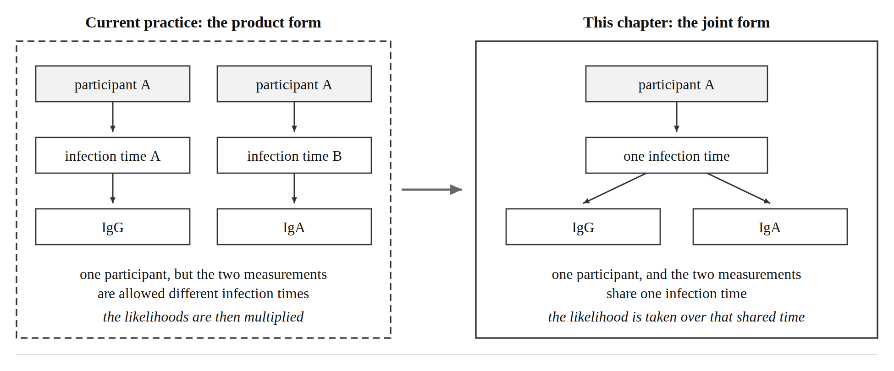
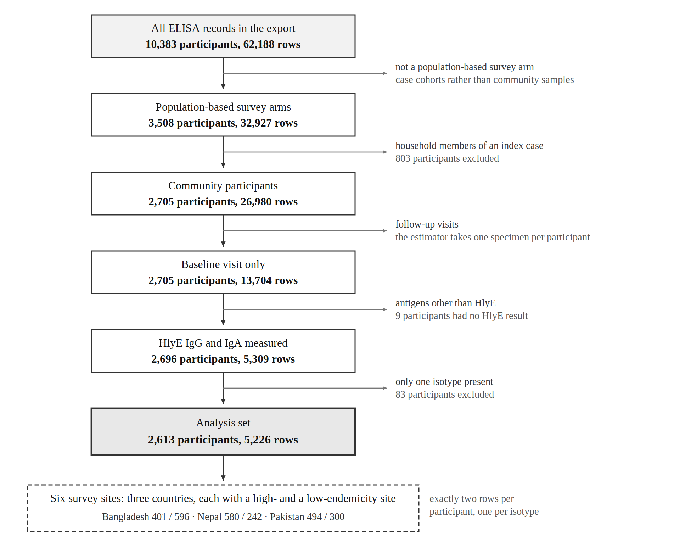
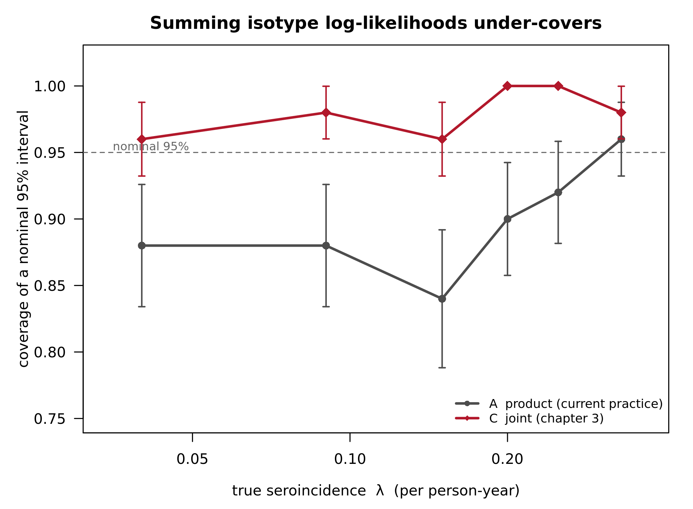
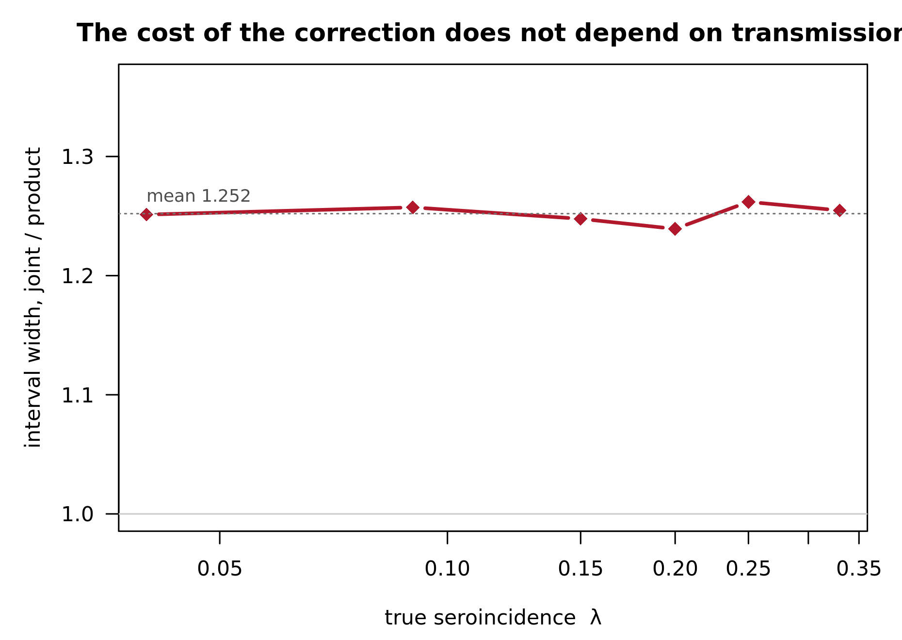
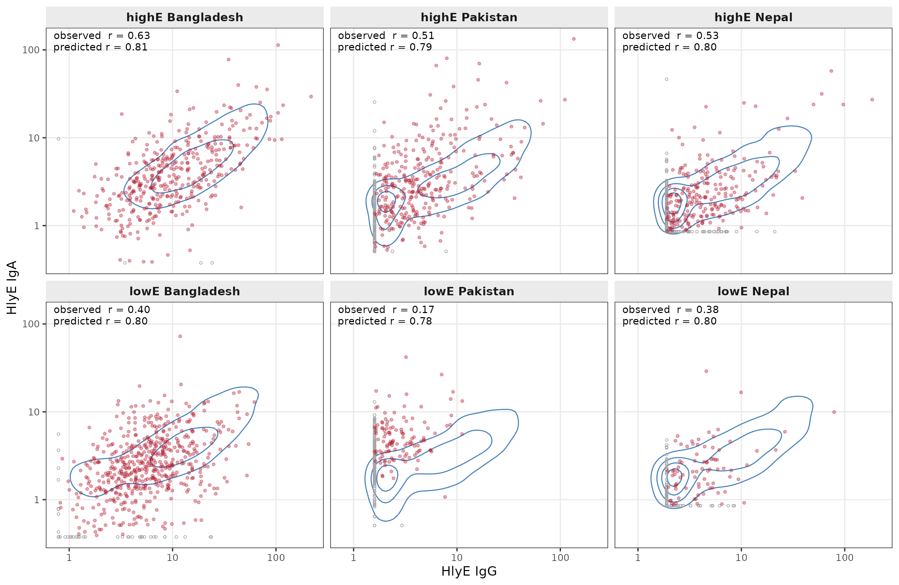
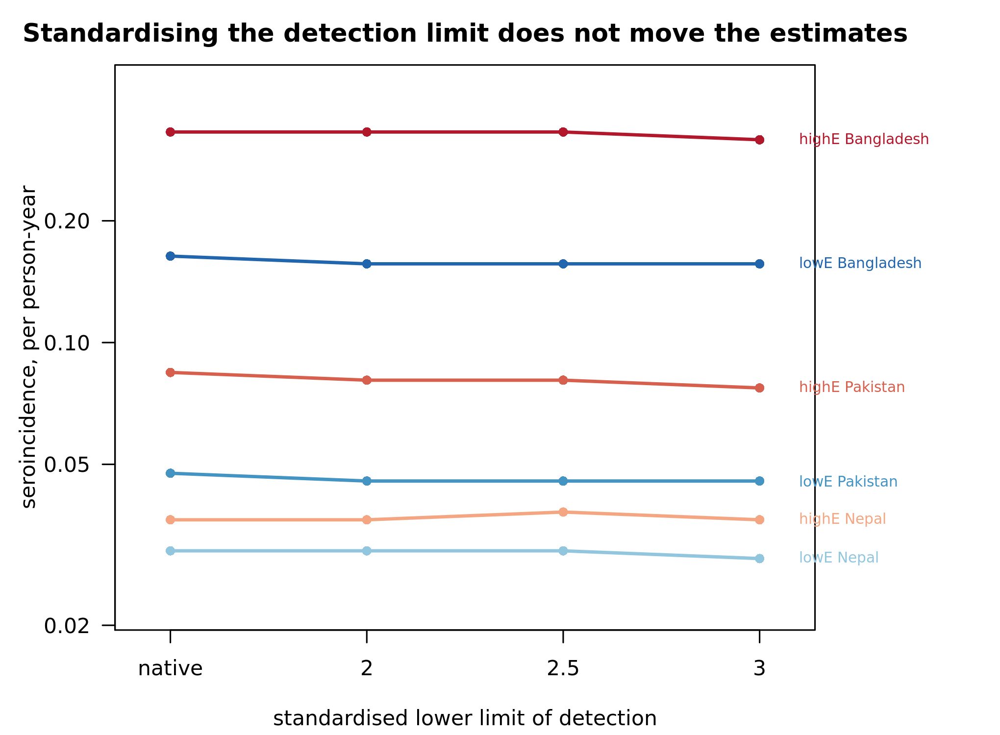

```{r}
#| label: setup-tables
#| include: false
# nolint start: line_length_linter.
#   The table chunks below hold their contents as literal character vectors, one
#   row per line. Wrapping those lines to eighty characters would split a row
#   across two lines and make the table harder to read and to edit than the long
#   line it replaces, so the line-length rule is suspended for this file. Every
#   line of actual code stays within eighty characters.
library(flextable)
library(officer)

set_flextable_defaults(font.family = "Times New Roman", font.size = 10,
                       padding.top = 2, padding.bottom = 2,
                       border.color = "black")

# Markdown emphasis sometimes survives in exported CSV headers and cells, and
# flextable renders it literally, so it is stripped on the way in.
strip_md <- function(x) {
  x <- as.character(x)
  x <- gsub("\\*\\*|__", "", x)
  x <- gsub("\\*|_", "", x)
  x <- gsub("[\r\n]+", " ", x)
  trimws(gsub(" +", " ", x))
}

thesis_ft <- function(df, widths = NULL, first_left = TRUE) {
  ft <- flextable(df)
  ft <- theme_booktabs(ft)
  ft <- fontsize(ft, size = 10, part = "all")
  ft <- bold(ft, part = "header")
  ft <- align(ft, align = "center", part = "header")
  if (ncol(df) > 1)
    ft <- align(ft, j = 2:ncol(df), align = "center", part = "body")
  if (first_left)   ft <- align(ft, j = 1, align = "left", part = "all")
  ft <- padding(ft, padding.top = 2, padding.bottom = 2, part = "all")
  ft <- valign(ft, valign = "center", part = "all")
  if (!is.null(widths)) ft <- width(ft, width = widths)
  ft <- set_table_properties(
    ft, layout = "fixed", align = "center",
    opts_word = list(split = FALSE, keep_with_next = TRUE)
  )
  ft <- hrule(ft, rule = "atleast", part = "body")
  ft <- line_spacing(ft, space = 1.15, part = "all")
  ft <- paginate(ft, group = NULL, init = TRUE, hdr_ftr = TRUE)
  ft
}
```


<!--
NO ANALYSIS IS RUN AT RENDER TIME, AND THAT IS DELIBERATE.

Every number is written out or read from a stored table, and every figure is included as a finished PNG.
The analysis lives in versioned R scripts that run on the compute server where the data are held; the bridge between the two is the CSV tables those scripts write.

Three things follow.
The manuscript renders anywhere Quarto and flextable are installed, with no access to the data and no analysis packages.
It can therefore be reviewed in a repository that must not contain participant data.
And a number in the text that disagrees with the corresponding CSV is a discrepancy someone can find, which is not true of a number a chunk computes on the fly. -->




# Abstract {.unnumbered}

Cross-sectional serosurveys can estimate the seroincidence rate of enteric fever by leveraging antibody decay dynamics estimated from confirmed cases.
These methods recover the same rank-order burden as blood-culture-based clinical incidence estimates, while requiring a fraction of the time, cost, and infrastructure.
The established estimator combines biomarkers by adding their log-likelihoods, which treats a participant's two measurements as though they came from two independently infected people.

The established estimator makes two assumptions that we relax: that a participant's biomarkers arise from separate infections, and that their kinetic parameters are drawn independently of one another.
We derived a joint likelihood in which the biomarkers share one infection time and their kinetic parameters are drawn together, and we verified that it reproduces the established estimator when only one biomarker is measured.
We evaluated the coverage of both in a simulation study spanning an eightfold range of seroincidence, and separated the two assumptions so that each contribution could be measured.
We applied all three forms to the Surveillance for Enteric Fever in Asia (SEES) cross-sectional serosurveys, covering 2,613 participants in Bangladesh, Nepal, and Pakistan.

An interval constructed to have 95% coverage contained the true seroincidence 89.7% of the time when built by adding log-likelihoods; the joint form restored coverage to 98.0%, at a cost in width of about a quarter that held across the range of seroincidence examined.
The two forms recovered the true seroincidence with almost the same error: relative root mean squared error was 10.16% for the product form and 9.53% for the joint form.
Sharing the infection time accounted for 76% of the correction and requires no result about correlation at all; pairing the parameter draws supplied the remainder.
Applied to the serosurveys, every interval widened and no epidemiological conclusion changed: the ranking of countries and the high- versus low-endemicity contrasts held.

Seroincidence remains a useful, lower-cost approach for ranking enteric fever burden and supporting vaccine-prioritization decisions, but when multiple biomarkers are combined, the current method likely reports uncertainty that is too narrow.
The point estimates are not in question, and no published incidence estimate is shown to be wrong; what is too confident is the uncertainty around them.



<!-- The kinetic curve is defined in the kinetics analysis; a manuscript that stands alone has to carry it. -->

The kinetic model is the two-phase curve estimated by the longitudinal kinetics analysis of these cohorts [@lee2026correlated].
For elapsed time $t$ since infection it is

$$
y_{ik}(t)=
\begin{cases}
y_{0,ik}\,\exp\!\big(\mu_{ik}\,t\big), & 0 \le t \le t_{1,ik},\\[6pt]
y_{1,ik}\Big[1+(r_{ik}-1)\,\alpha_{ik}\,y_{1,ik}^{\,r_{ik}-1}\,(t-t_{1,ik})\Big]^{-1/(r_{ik}-1)},
& t > t_{1,ik},
\end{cases}
$$ {#eq-curve}

<!-- Lifted from the dissertation bridge, which no manuscript contains. -->

The joint form changes two things at once, and they are separable:

$$
\underbrace{\text{one infection time per participant}}_{\text{independent of the kinetic model}} \qquad \underbrace{\text{paired kinetic parameters}}_{\text{supplied by the kinetic model}}
$$ {#eq-two-assumptions}


# Introduction {#sec-ch3-intro}

Enteric fever caused an estimated nine million illnesses and over a hundred thousand deaths in 2021, concentrated in South Asia and sub-Saharan Africa [@gbd2021typhoid].
Safe and effective conjugate vaccines exist, and the World Health Organization recommends their introduction in settings of high burden [@who2019tcv].
Deciding where to introduce them requires estimates of infection rates, which are unavailable in most high-burden settings: blood culture surveillance requires laboratory infrastructure and sustained financing, and even where it is in place it detects only the fraction of infections that produce symptoms, reach care, and yield a positive culture.
Seroincidence estimation was developed to fill that gap: one blood draw per participant in a randomly selected population sample, analyzed against a model of how antibodies behave after infection, yields an infection rate for the population — including the asymptomatic and unrecognized infections that never reach a clinic [@simonsen2009; @teunis2020; @aiemjoy2022; @aiemjoy2023serodynamics].
Sample sizes of a few hundred per age stratum are sufficient, which puts the method within reach of settings where sustaining blood culture surveillance is not realistic.

Alternative serological approaches exist and make different trade-offs.
Seroprevalence compares the proportion above a threshold between populations, which is simple but discards the quantitative signal and cannot separate recent from remote infection [@arnold2019].
Methods built on paired sera require two visits per participant.
Antibody-dynamic methods of the kind used here need only one visit and recover a rate rather than a prevalence, at the cost of depending on a model of the kinetics — which is what makes the fidelity of that model, and of the likelihood built on it, the subject of this chapter.

An estimate that informs decisions of that consequence should be accompanied by an honest account of its uncertainty.
This chapter is about a place where that account is currently too optimistic, and about how much too optimistic it is.

## Seroincidence estimation from cross-sectional serosurveys {#sec-ch3-gap}

Most serosurveys measure more than one antibody isotype, and combining them should sharpen the estimate.
The established implementation, `serocalculator` [@serocalculator2025], combines them by adding log-likelihoods.
The implementation assumes that seroresponses from different isotypes are independent, which permits their log-likelihoods to be summed:

$$
\ell(\lambda)=\sum_{i}\sum_{j=1}^{J}\log L_{ij}(\lambda)
$$ {#eq-sumll}

On that assumption the sum increases the precision of the seroincidence estimate, and it is that consequence this chapter examines.
Adding log-likelihoods does increase apparent precision.
Whether that precision is real depends on whether the terms being added are independent, and a participant's two measurements are not: they come from one person, one infection, and one specimen.
However long ago that infection occurred, it is a single interval of time, shared by both isotypes.

What the pair carries that neither marker carries alone is easiest to see for one participant.
A high IgA response together with a low IgG response points to a more recent exposure than elevated IgA and IgG together: the combination locates the infection in time in a way neither concentration does by itself.
A likelihood that integrates each isotype over its own infection time discards precisely that information, and then reports a narrower interval for having done so.

The software's own simulator gives each participant one infection time and one set of kinetic parameters, and reads both isotypes from that single state.
Its estimator then integrates each isotype over its own infection time and multiplies the results.
The two components describe different data-generating processes, and only one of them matches how the data were collected.

## Consequences of the independence assumption {#sec-ch3-stakes}

Counting one specimen as two independent observations is a form of composite likelihood — a product of valid marginal likelihoods that is not itself the likelihood of the data [@lindsay1988; @varin2011].
The consequence is known in general terms: the estimator remains consistent, but the curvature of the composite log-likelihood overstates the information in the sample, so intervals built from it in the usual way are narrower than they should be [@godambe1960; @chandler2007].

Intervals that are too narrow lead to overconfident comparisons between settings, which matters because these estimates inform burden rankings and vaccine introduction decisions.
It is also the kind that does not announce itself: an interval that is too narrow looks like a better result, not a worse one, and nothing in the output distinguishes it from a genuinely precise one.

The precedent is instructive.
When antibody decay was ignored altogether in an earlier generation of serosurveillance methods, the burden was underestimated by more than half [@aiemjoy2024scrub].
Assumptions made for tractability in seroepidemiology have not historically been harmless, so we checked this one before carrying it into further applications.

## Coverage as the evaluation criterion {#sec-ch3-coverage}

An interval can be widened by anyone.
Multiplying it by two makes it wider without making it right.

The quantity that decides whether a wider interval is a better interval is coverage — the proportion of intervals that contain the true value when the true value is known — which is the standard target for evaluating an interval procedure by simulation [@morris2019].
A nominal 95% interval should contain the truth 95% of the time.
If the current method's intervals contain it less often than that, they are not merely narrower than an alternative; they are wrong, and by a measurable amount.

Coverage is therefore the primary endpoint of this chapter, and it is the reason the chapter can make a claim about the published literature rather than only about a comparison between two estimators written here.
A statement that one interval is twice as wide as another is a statement about that code.
A statement that an interval reported as 95% covers far less often than that is a statement about every published estimate computed the same way.

## Pre-specified analyses {#sec-ch3-honest}

The argument above is a prediction, not a result, and it has failure modes that were specified before anything was run.

The conventional diagnostic could disagree.
The standard way to show that a composite likelihood overstates precision is a cluster-robust (sandwich) standard error with the participant as the cluster [@chandler2007; @ribatet2012].
If within-participant dependence is real, that correction should inflate the standard error.
We report it whether or not it does, and if it does not, the disagreement between it and the coverage study is itself a finding that has to be explained rather than omitted.

The effect could be small.
Two considerations suggested it might be.
The inversion uses the decay phase only, so the pre-infection level and the time to peak — among the most strongly correlated parameters in that analysis — do not enter.
And where incidence is low, most specimens sit far along the decay curve, where neither isotype carries much information about timing.
A correction whose effect is small is still worth making if it is the correct one, and knowing that it is small tells the next study that precision has to come from somewhere else.

The apparent effect could be an artifact of the data, not of the likelihood.
Two features of these serosurveys could produce a spurious difference between countries: detection limits that differ by laboratory, and age structures that differ by survey arm.
Both are examined as pre-specified sensitivity analyses (@sec-ch3-sens) with predictions recorded in advance.

## The established seroincidence estimator {#sec-ch3-setup}

We used the estimator implemented in `serocalculator` [@serocalculator2025] and followed the notation in its methodology vignette so readers can compare each step directly.

The model assumes that infections occur randomly over a participant's lifetime according to a Poisson process with rate $\lambda$, the seroconversion rate in infections per person-year, which is the quantity we estimate.
For a participant of age $a$, the model first distinguishes between participants who have never been infected and those who have been infected at least once.
Among those who have been infected, $\tau$ denotes the time since the most recent infection, and its density is exponential truncated at the participant's age,

$$
\Pr(\text{never infected}\mid a,\lambda)=e^{-\lambda a},
\qquad
f(\tau\mid a,\lambda)=\lambda e^{-\lambda\tau},\quad 0<\tau<a .
$$ {#eq-brt}

In a cross-sectional serosurvey we do not know when, or whether, a participant was infected.
We therefore treat the time since infection as an unobserved quantity and average the likelihood over its possible values, rather than using it as a covariate.
We write this unobserved time as $\tau$ to distinguish it from the observed time $t$ in the longitudinal cohorts, where blood culture confirmed the date of infection.
The curve of @eq-curve is unchanged; what differs is that its origin is now unknown.
Two symbols in @eq-brt depart from the vignette's own: it writes
this elapsed time $T$, for which $\tau$ is substituted here for the reason just given, and it writes
every density $p$, whereas the density of $\tau$ is written $f$ throughout so that it stays visually distinct from the observation densities it is integrated against.

Given $\tau$ and a set of kinetic parameters $\boldsymbol\theta$, @eq-curve gives the noise-free
concentration $y_f=y(\tau;\boldsymbol\theta)$; a measurement $y$ is then a noisy realization of it.
For a single biomarker the contribution of one participant is

$$
L_i(\lambda)=\underbrace{\int_0^{a_i} \Big[\textstyle\frac1M\sum_{k=1}^{M} p\big(y_i \mid y(\tau;\boldsymbol\theta^{(k)})\big)\Big]\, f(\tau\mid a_i,\lambda)\,d\tau}_{\text{infected before age } a_i} \;+\; \underbrace{e^{-\lambda a_i}\,\Big[\textstyle\frac1M\sum_k p\big(y_i\mid y_{0}^{(k)}\big)\Big]}_{\text{never infected}},
$$ {#eq-single}

where $\boldsymbol\theta^{(k)}=(y_0,y_1,t_1,\alpha,r)^{(k)}$, $k=1,\dots,M$, are posterior draws of the kinetic parameters of @eq-curve.
The inner average is a Monte Carlo approximation to $\int p(y\mid\tau,\boldsymbol\theta)\,p(\boldsymbol\theta)\,d\boldsymbol\theta$: an individual's own kinetics are unknown, so we integrate over the population distribution, using the posterior draws as the sample for that integral.

The measurement model is a two-stage convolution, not a single error term: biological noise is additive uniform on $(0,\nu)$ and measurement noise is multiplicative uniform on $(1-\varepsilon,1+\varepsilon)$, giving the closed form derived in @sec-appB-noise.
Values at or below the assay's detection limit contribute the probability $\Pr(Y\le y_{\text{low}})$ rather than a density.

## The independence assumption in the current likelihood {#sec-ch3-product}

Write $J$ for the number of biomarkers combined for one participant — $J=2$ throughout this chapter, HlyE IgG and HlyE IgA — and reserve the subscript $j$ for the biomarker and the superscript $(k)$ for the parameter draw, as the vignette does.
With $J$ biomarkers the established implementation applies @eq-single to each biomarker in turn and sums the resulting log-likelihoods,

$$
\ell_{\mathrm{prod}}(\lambda)=\sum_{i}\sum_{j=1}^{J}\log L_{ij}(\lambda),
$$ {#eq-prodform}

which is the logarithm of their product.
Each biomarker is therefore integrated over its own
$\tau$ and its own independently drawn $\boldsymbol\theta$. For a participant with $J=2$ the two
integrals are unconstrained with respect to each other: the IgG term may place its weight on an
infection thirty days ago while the IgA term places its weight on one three hundred days ago, and the product accepts both (@fig-ch3-assume). 

::: {#fig-ch3-assume}
{width=100%}

**What summing the log-likelihoods assumes.** Both panels describe the same participant, whose IgG
and IgA are measured on one specimen.
Under current practice (left) the two measurements are allowed
to carry different infection times, because each biomarker is integrated over its own; the joint
form (right) requires them to share one.
The panels differ in that one place, and @eq-shared relaxes
exactly it, leaving everything else as it is.
The arrows show how the model generates a measurement
rather than how the estimate is computed: the infection time is never observed, and the estimator
integrates over it.
:::

Multiplying out @eq-prodform for $J=2$ makes a second objection visible, and it does not depend on
any claim about correlation.
The product of two two-branch expressions has four terms rather than
two.
Two of them pair the infected branch of one biomarker with the never-infected branch of the
other, and those are not events: infection is a property of the participant, not of the assay, so a
person cannot have been infected with respect to IgA and never infected with respect to IgG. The
fourth term gives the never-infected state weight $e^{-2\lambda a}$ rather than $e^{-\lambda a}$,
which is the weight of two independent never-infections.
The forms below have two branches, not
four.

The vignette states a different model from the one the code computes, and says so: the
biomarkers are described there as conditionally independent *given* the time since infection, so
that their densities multiply inside a single integral over $\tau$ rather than outside two separate
ones [@serocalculator2025]. The `serocalculator` issue tracker records the discrepancy (UCD-SERG/serocalculator#637), and an implementation of the shared-time form is open there as well (#646).
What
follows takes the stated model as the starting point and asks what else follows from it.

## Objectives {#sec-ch3-aims}

We derived a joint likelihood in which the infection time is shared between isotypes and the kinetic parameters are paired, separating the two assumptions so that their contributions can be attributed individually (@eq-two-assumptions).
Because no joint likelihood exists in the available software, we implemented it and verified that it reproduces the established estimator in the single-biomarker case, where the two forms are the same integral and must agree exactly.
We then evaluated coverage on simulated cross-sectional data with known $\lambda$, across a range of seroincidence chosen to span the observed settings, reporting coverage, interval width, and bias for both likelihoods.
Finally we applied the forms to the SEES cross-sectional serosurveys in three countries, crossing the likelihood form with the parameter draws so that the paired and independent draws of @sec-ch3-banks enter without any additional model fitting, and asked whether the epidemiological conclusions — the ranking of countries and the contrast between high- and low-endemicity arms — survive.

The correction is not intended to displace the existing method.
It is intended to establish how much the simplification costs, so that a practitioner combining isotypes knows whether the resulting interval can be taken at face value — and, if the cost is small, can continue to use the faster calculation knowing what has been checked.

# Methods {#sec-ch3-methods}

## Study population and sample {#sec-ch3-data}

Cross-sectional data come from the population-based serosurveys conducted alongside the SEES case cohorts: high-endemicity and low-endemicity household surveys in each of Bangladesh, Nepal and Pakistan [@aiemjoy2022].
We measured antibody responses against hemolysin E (HlyE), a pore-forming toxin that *Salmonella* Typhi and Paratyphi A express during human infection and the most immunoreactive antigen identified in confirmed enteric fever.
HlyE IgG and IgA were measured by the same ELISA as in the longitudinal cohorts, so the parameter draws and the specimens they are applied to are on one scale.

We restricted the analysis to the two population-based survey arms, high- and low-endemicity, which sample the community rather than the case cohorts that provided the kinetic estimates.
We excluded household members enrolled alongside an index case, whose exposure is that of a household containing a known case rather than that of the community; including them would attach a case's household to a population rate.
From the remaining participants we used the baseline visit only, because the estimator takes one specimen per participant and a later visit from the same person is not a second draw from the population.
A participant entered the analysis if both HlyE IgG and IgA, the two biomarkers the kinetic model treats jointly, were measured at that visit; one isotype alone carries no information about the pairing that separates the three likelihood forms.
The number remaining after each step is given in @fig-ch3-flow.

::: {#fig-ch3-flow}
{width=100%}

**Participant flow.** Records and participants remaining after each selection rule, from the full
ELISA export to the analysis set.
The final set has exactly two rows per participant, one per
isotype.
:::

The final analysis sample comprised 2,613 participants, each contributing one HlyE IgG and one HlyE IgA measurement with no missing age or concentration.
The household identifier is one-to-one with the participant identifier in these two arms, so no household clustering survives the second rule; 48% are male, ranging from 35% to 53% across the six sites.
The six country-by-endemicity sites are described in @tbl-cells.
Measurements below the detection limit are retained at the limit and enter as censored contributions rather than being dropped, for the reason given there [@lee2026correlated].

Specimens were collected between February 2019 and June 2021, but not on a common schedule.
Five of the six sites sampled across 13 to 16 calendar months, with a gap through the middle of 2020 when field work was suspended; the low-endemicity Pakistan site drew all 120 of its specimens within eleven days in January 2021 (@tbl-collect).
A site sampled in a single window sits at one point in the transmission year rather than across it, which bears on @sec-ch3-res-shift.

## Alternative likelihood formulations {#sec-ch3-joint}

The derivation starts from the generative model rather than from @eq-prodform. A participant has
one infection time and one vector of kinetic parameters; given both, the two measurements are
conditionally independent because their assay noise is independent.
For a participant infected before
age $a$,

$$
p(y_1,y_2)=\int_0^{a}\!\!\int_{\boldsymbol\theta} p(y_1\mid\tau,\boldsymbol\theta_1)\,p(y_2\mid\tau,\boldsymbol\theta_2)\, p(\boldsymbol\theta_1,\boldsymbol\theta_2)\,d\boldsymbol\theta\; f(\tau\mid a,\lambda)\,d\tau .
$$ {#eq-truegen}

No assumption has been imposed at this point.
That a participant has one $\tau$ is a fact about people, not a modeling choice, and $p(\boldsymbol\theta_1,\boldsymbol\theta_2)$ is left as a joint distribution.

Approximating the parameter integral with the posterior draws, using the same draw index for both biomarkers, and exchanging the sum with the integral — which is exact, by linearity — gives the joint likelihood: a single $\tau$ and a single draw index shared across biomarkers,

$$
L_i^{\mathrm{joint}}(\lambda)=
\int_0^{a_i}\Big[\frac1M\sum_{k=1}^{M}\prod_{j=1}^{J}
p\big(y_{ij}\mid y(\tau;\boldsymbol\theta_j^{(k)})\big)\Big]
f(\tau\mid a_i,\lambda)\,d\tau
\;+\;e^{-\lambda a_i}\Big[\frac1M\sum_k\prod_j p\big(y_{ij}\mid y_{0j}^{(k)}\big)\Big].
$$ {#eq-joint}

$$
\ell_{\mathrm{joint}}(\lambda)=\sum_i \log L_i^{\mathrm{joint}}(\lambda).
$$ {#eq-jointsum}

Using the same draw index $k$ for both biomarkers is what draws from the joint distribution; using separate indices would draw from the product of the two marginals, which is the assumption @eq-truegen declines to make.

Between @eq-prodform and @eq-joint sits a third arrangement, and it is the one the vignette specifies: the infection time is shared but each biomarker is still averaged over the draws separately.

$$
L_i^{\mathrm{shared}}(\lambda)=
\int_0^{a_i}\prod_{j=1}^{J}\Big[\frac1M\sum_{k=1}^{M}
p\big(y_{ij}\mid y(\tau;\boldsymbol\theta_j^{(k)})\big)\Big]
f(\tau\mid a_i,\lambda)\,d\tau
\;+\;e^{-\lambda a_i}\prod_{j}\Big[\frac1M\sum_k p\big(y_{ij}\mid y_{0j}^{(k)}\big)\Big].
$$ {#eq-shared}

@eq-shared and @eq-joint differ in the order of $\prod_j$ and $\frac1M\sum_k$ and in nothing else,
which is what makes the second assumption isolable.
The three log-likelihoods compared in this chapter are

$$
\ell_{\mathrm{prod}},\qquad
\ell_{\mathrm{shared}}=\sum_i\log L_i^{\mathrm{shared}},\qquad
\ell_{\mathrm{joint}} .
$$ {#eq-threeforms}

These three exhaust the arrangements: with a sum, an integral, and a product to order, the product form places the product outermost, the shared-time form the integral, and the joint form the sum.
The three forms differ only in this ordering, which @sec-appB-deriv sets out side by side.
The shared-time form is what makes the two assumptions separable rather than a single change, and @sec-ch3-design uses it for exactly that.

## Decomposition of independence assumptions {#sec-ch3-decomp}

@eq-joint changes two things at once.
They are separable, and separating them is what allows their contributions to be attributed.

$$
p(y_1,y_2\mid \tau)=\iint p(y_1\mid\tau,\boldsymbol\theta_1)\,p(y_2\mid\tau,\boldsymbol\theta_2)\,
p(\boldsymbol\theta_1,\boldsymbol\theta_2)\,d\boldsymbol\theta_1 d\boldsymbol\theta_2
$$ {#eq-condindep}

where $\boldsymbol\theta_1$ and $\boldsymbol\theta_2$ are the participant's kinetic parameters for
the two biomarkers and $p(\boldsymbol\theta_1,\boldsymbol\theta_2)$ is their joint population distribution — the object the kinetics analysis estimated.

If $p(\boldsymbol\theta_1,\boldsymbol\theta_2)$ factorizes, @eq-joint reduces to @eq-shared, in
which only $\tau$ is shared.
It does not factorize — that is the result of the kinetics analysis — so both terms are
active.

The difference the second assumption makes is exactly a covariance across draws.
Writing $\bar q_j(\tau)$ for the average of biomarker $j$ over the draws and $q_j^{(k)}(\tau)$ for its value under
draw $k$, the definition of a sample covariance gives

$$
\frac1M\sum_k q_1^{(k)}q_2^{(k)} =\bar q_1\,\bar q_2+\widehat{\operatorname{Cov}}_k\big(q_1,q_2\big),
$$ {#eq-covdraws}

so @eq-joint differs from @eq-shared by $\int_0^{a}\widehat{\operatorname{Cov}}_k\big(q_1(\tau),q_2(\tau)\big)\,f(\tau\mid a,\lambda)\,d\tau$ and by nothing else.
The correlation estimated by the kinetics analysis enters here, and only here — not as a parameter of the likelihood but as a covariance taken across the parameter draws.
Two sets of draws with the same marginal distributions can differ entirely in it, which is the relation defined next.

Three distinct correlations are now in play, and they are easy to conflate even though only one of them is a parameter.
The cross-isotype correlation $ ho_c$ is a correlation between kinetic parameters — between the peak a participant would reach in IgG and the peak they would reach in IgA — and the kinetics analysis estimates it [@lee2026correlated]. $\widehat{\operatorname{Cov}}_k$ in @eq-covdraws is a covariance between two **density values** at a fixed $\tau$, taken across the parameter draws; it asks whether the draws that explain a participant's IgG well are the same rows that explain their IgA well, and we compute it rather than estimate it.
The correlation between the two observed log concentrations is a third thing again, and it is neither of the first two: it is the quantity @sec-ch3-res-shift compares against what the parameter draws predict. **A set of draws can carry a large $\rho_c$ and still fail to reproduce the observed correlation**, and whether it does is a property of the draws rather than of $\rho_c$.

The two assumptions can be stated separately.
The first is that a participant's biomarkers arise from one infection rather than from separate ones; relaxing the current estimator on this axis requires no result from the kinetics analysis at all.
The second is that the kinetic parameters of the two isotypes are drawn as a pair, preserving the cross-isotype correlation.
This is where the kinetics analysis enters, and only here.
The shared infection time does not depend on it, and this matters for how the chapter's conclusion should be read.
A reader who is unconvinced by the kinetics analysis still has to accept that a participant has one infection time.
The design of @sec-ch3-design is built so that the contribution of the shared infection time can be read off separately, and if it is the larger of the two, the main result of this chapter is independent of the previous one.

## Posterior parameter draws {#sec-ch3-banks}

We drew parameter values from the posterior distribution of the kinetics analysis and converted them to the form the estimator expects, keeping the draw index — that index is the only thing linking a participant's IgG parameters to their IgA parameters, and the pairing in @eq-joint depends on it.

```{r}
#| label: tbl-banks
#| echo: false
#| tbl-cap: |
#|   **The three sets of parameter draws.** All three are posterior predictive draws for a new
#|   participant from the kinetics analysis fits, differing only in how the two isotypes are
#|   associated within a row. The independent draws fix the cross-covariances at zero; the
#|   shuffled draws have the same marginal distributions as the paired draws with the
#|   pairing destroyed, and serves as the control for the second assumption.
d <- as.data.frame(do.call(rbind, list(
  c("paired", "the kinetics analysis primary", "estimated", "both assumptions"),
  c("independent", "same model, c fixed at 0", "0", "the shared infection time alone"),
  c("shuffled", "paired draws, IgA rows reordered", "marginals preserved", "control for the pairing")
)), stringsAsFactors = FALSE)
names(d) <- c("Draws", "Fit", "c", "Isolates")
thesis_ft(d, widths = c(0.9, 2.46, 1.56, 1.48))
```

The independent draws come from the same model specification with $\mathbf c$ held at zero, so the two sets differ in the cross-block alone.
All three are drawn from the predictive distribution for a new participant, not from the population mean.
Substituting the mean would assert that every participant follows the average trajectory and would make a single concentration far more informative about $\tau$ than it is.
All are restricted to the chains retained by the log-density filter of the kinetic fit [@lee2026correlated] and thinned to a common number of draws.
Conversion from the parameterization used to fit the kinetics [@lee2026correlated] requires inverting the decay reparameterization, $\alpha=k_{\mathrm{dec}}/y_1^{\,r-1}$.

We report the correlation carried by each set of draws as a check before using any of them, since paired draws that do not carry the correlation, or shuffled draws that still do, would make every downstream contrast meaningless.

## Study design {#sec-ch3-design}

The likelihood form and the parameter draws are two crossed factors, not one: the product likelihood can be run with the paired draws just as the joint likelihood can be run with the independent ones.

```{r}
#| label: tbl-design
#| echo: false
#| tbl-cap: |
#|   **The three likelihood forms.** They differ only in the order of the sum over parameter
#|   draws, the integral over infection time, and the product over biomarkers. The average
#|   over draws for biomarker j is written q̄ⱼ, and its value under draw k is qⱼ⁽ᵏ⁾; f is the
#|   density of @eq-brt. Reading down the table turns the two assumptions on one at a time:
#|   the shared-time form shares the infection time alone, and the joint form adds the pairing of parameter draws.
#|   The rows correspond to @eq-prodform, @eq-shared and @eq-joint.
d <- as.data.frame(do.call(rbind, list(
  c("product", "[∫ q̄₁ f][∫ q̄₂ f]", "current practice: separate τ, separate draws"),
  c("shared time", "∫ q̄₁ q̄₂ f", "one τ, draws still averaged separately — the shared infection time alone"),
  c("joint", "(1/M) Σ_k ∫ q₁⁽ᵏ⁾ q₂⁽ᵏ⁾ f", "one τ and paired draws — both assumptions")
)), stringsAsFactors = FALSE)
names(d) <- c("form", "Order of operations", "Isolates")
thesis_ft(d, widths = c(0.97, 1.62, 3.81))
```

The same function evaluates all three.
They share the noise density, the quadrature grid, the two-branch mixture of @eq-brt, the censoring rule, and the time units; the code branches in one place, on the order of the sum, the integral, and the product.
The derivation is in @sec-appB-deriv.

Two contrasts follow, and they partition the difference between current practice and the joint form:

$$
\underbrace{\;\ell_{\mathrm{shared}}-\ell_{\mathrm{prod}}\;}_{\text{sharing one infection time}}
\qquad
\underbrace{\;\ell_{\mathrm{joint}}-\ell_{\mathrm{shared}}\;}_{\text{pairing the draws}}
\qquad
\underbrace{\;\ell_{\mathrm{joint}}-\ell_{\mathrm{prod}}\;}_{\text{both together}}
$$ {#eq-contrasts}

The comparator is internal for a specific reason.
It would be more direct to
compare the joint form against the established implementation, but that comparison is not made.

The two codebases differ in the noise convention, in the density assumed for time since infection,
in the handling of the never-infected branch and in the time units.
On the same six datasets the product form and the established implementation differ by up to 8.5% (@tbl-ref).
A contrast against the
package would therefore mix the independence assumption with four other differences, and could not
be attributed to any of them.

Placing all three forms in one function removes that entire class of ambiguity by construction.
What
is lost is the direct claim "the published implementation under-covers"; what is gained is that the
contrast measures the independence assumption and nothing else.
We report the established implementation once, as a reference, so that the size of the discrepancy is on the record.

A separate set of contrasts varies the parameter draws rather than the likelihood forms, and
serves as an implementation check, not a result.
The shuffled draws are the paired draws with the IgA rows reordered: identical marginal distributions, pairing destroyed.
Because the
product form integrates each biomarker separately, it cannot see the pairing, so

$$
(\text{product},\mathbf c) - (\text{product},\text{shuffled}) = 0 \qquad\textbf{exactly, not approximately.}
$$ {#eq-nullcheck}

We recorded one contrast before seeing the results.
The product likelihood cannot see the pairing.
It integrates each biomarker separately, so replacing the paired draws with ones that have identical marginals and destroyed pairing must give the same number — not a close one.

This is not an approximation that should hold to within simulation error; it is the algebraic identity of @eq-nullcheck.
Any departure from zero indicates that the implementation is using the pairing somewhere it should not, and would invalidate every other contrast.
Recording the prediction in advance makes it a test of the implementation, not a description of its output.

## Implementation verification {#sec-ch3-valid}

The three forms are algebraically identical when only one biomarker is measured, because the product over biomarkers has nothing to reorder.
We used this as the first check on our implementation.
Setting $J=1$ in @eq-joint and @eq-prodform returns @eq-single, so the two must agree:

$$
\ell_{\mathrm{joint}}(\lambda)\big\rvert_{J=1}
=\ell_{\mathrm{prod}}(\lambda)\big\rvert_{J=1}
\qquad\text{for all }\lambda .
$$ {#eq-valid}

We checked this across a grid of $\lambda$ spanning the plausible range, separately for IgG and IgA,
and against the existing compiled implementation rather than against a second version of my own
code.
We required agreement to four decimal places before computing any two-biomarker quantity.

A second identity applies once all three forms live in one function.
With $J=1$ the three
expressions of @eq-threeforms collapse to the same integral, because a Monte Carlo mean and a
quadrature sum commute:

$$
\ell_{\mathrm{prod}}(\lambda)\big\rvert_{J=1}=
\ell_{\mathrm{shared}}(\lambda)\big\rvert_{J=1}=
\ell_{\mathrm{joint}}(\lambda)\big\rvert_{J=1}.
$$ {#eq-threeform}

Unlike @eq-valid this is an identity within a single implementation, so it should hold to machine precision rather than to four decimals.
A disagreement would be an indexing error, not a modeling choice, and the check costs seconds.

We describe the gate in some detail because it caught errors that would otherwise have propagated.
It identified four separate errors in the first implementation, none of which would have produced an obviously wrong two-biomarker number:

The noise density was a placeholder rather than the two-stage convolution of @sec-appB-noise.
Left censoring was not handled: observations at or below the detection limit require $\Pr(Y\le y_{\text{low}})$ rather than a density, and the resulting IgG error was roughly thirty times the IgA error, IgG being the more heavily censored isotype.
Units were inconsistent, the decay rate being stored per day while age and $\lambda$ are in years; the existing implementation rescales by 365.25 for exactly this reason.
And the mixture weights over whether a participant was ever infected, $1-e^{-\lambda a}$ and $e^{-\lambda a}$ (@eq-brt), had been omitted.

Each of the four would have produced a plausible number, not an obviously wrong one, which is the argument for running the gate before anything else.
The same class of error recurred later in the simulator (@sec-ch3-sim) and was caught by the same principle: check against a known answer before trusting an unknown one.

A second check compares the joint form against the product form under draws in which the isotypes are independent and the noise is made small: as the noise shrinks both concentrate on the same $\tau$, and the two should converge.

## Numerical evaluation {#sec-ch3-numeric}

Neither likelihood has a closed form in $\lambda$, so both are evaluated on a grid — a fixed ladder of candidate incidence values, spaced logarithmically, over which we compute the log-likelihood point by point.
Everything below concerns making that evaluation fast enough and fine enough.

We evaluated the integral in @eq-joint on a fixed quadrature grid in $\tau$, with participants binned by age so that the weight vector $f(\tau\mid a,\lambda)$ can be reused within a bin.
The biomarker-by-draw density matrix does not depend on $\lambda$ and is computed once per participant, which is what makes the profile over $\lambda$ affordable.
Grid resolution in $\tau$, the age bin width, and the number of posterior draws are all quantities we report, and we check the profile for insensitivity to each.
Implementation detail is in @sec-appB-numeric.

Intervals are profile likelihood intervals on a logarithmically spaced grid in $\lambda$, taken at a drop of 1.92 log-likelihood units from the maximum.
We report the grid spacing alongside every interval, because it sets the finest difference the method can express: a change smaller than one grid step is not a change the analysis can resolve, and we report it as such, not as a small effect.

## Simulation study of interval coverage {#sec-ch3-sim}

This is the primary evaluation.
Everything before it establishes that the joint likelihood is correctly implemented; this establishes whether the intervals it produces are the right width.

The design follows the standard for simulation studies [@morris2019]: we report a Monte Carlo standard error for every performance measure, and we fixed what counts as acceptable before running any grid.

The simulated sample size is $n=300$, at the lower end of the range the observed sites span — 242 to 596, with a median near 450 (@tbl-cells).
Evaluating calibration at a sample size no larger than the smaller surveys keeps the assessment from being more favorable than the data the method is applied to.

**Simulation design.** For each replicate: draw ages by resampling from the observed serosurvey; draw infection status and $\tau$ from @eq-brt at a known $\lambda$; draw one parameter index per participant, which is what preserves the pairing; evaluate @eq-curve for both isotypes at that $\tau$; apply the two-stage noise of @sec-appB-noise; and censor at the detection limit.
We then fit both likelihoods to the same simulated dataset and score both intervals.

We wrote the simulator out rather than taking it from the package.
This is not because the package generates from the product model — it does not, and its documentation is explicit that each individual's biomarkers share one latent infection history — but because its generative model differs from the estimator in other ways, set out below.
The simulator used here is the estimator run backward, so that the data-generating process and the joint likelihood are the same model stated in two directions.
That is what makes the resulting coverage number interpretable; a simulator that did not match would produce a plausible number that meant nothing.

Reading the package's generator also settled a question that had been open.
It draws infections as a Poisson process across the whole lifetime and sets the baseline of each new response to the level the previous one had decayed to, so antibody accumulates across infections.
The estimator, by contrast, models a single most-recent infection with a baseline drawn afresh.
The two are not the same model, which is a further reason why neither could serve as a reference for the other, and it bears on the discordance reported in @sec-ch3-res-app.

We validated the simulator before use, against the joint form rather than against the package.
Once the comparator is internal, the coherent question is no longer whether the simulator reproduces a second codebase — it is whether the simulator and the joint form are the same model stated in two directions.
The gate therefore asks the joint form to recover a $\lambda$ drawn from its own generating process, at three values spanning the range, before any coverage replicate is run.

Two earlier versions of this gate passed a simulator that was wrong, and both failures were failures of design rather than of execution.
We record them because they determined the tolerances now in use.
The first accepted agreement within 15%, but the discrepancy it was meant to detect was of the same order, so it could not detect it: a gate whose tolerance is not small relative to the quantity being explained is not a gate, and the tolerance is now 3% against a $\lambda$ grid resolved to 2.3%.
The second ran a single dataset at each $\lambda$, where at $n=300$ a single estimate carries a relative standard error near 9%, making a systematic 6% departure indistinguishable from noise.
Bias is now read from the 50 replicates of the coverage grid itself, whose Monte Carlo error is about 1.3%, rather than from a separate underpowered check.

**Conditions.** We evaluated coverage at six values of $\lambda$ spanning the range of estimates obtained in this analysis, with 50 replicates at each and both forms fitted to the same simulated datasets.
Reporting coverage at a single $\lambda$ would not establish a property of the method; a coverage curve does.
Two quantities are recorded for every simulated dataset, and they answer different questions (@tbl-cov-cond).

```{r}
#| label: tbl-cov-cond
#| echo: false
#| tbl-cap: |
#|   **Coverage study conditions.** Two quantities are recorded for every simulated dataset
#|   because they answer different questions. Whether the interval contains the truth is the
#|   calibration question this chapter asks; the relation between bias and width separates an
#|   interval that is mislocated from one that is correctly located but too short, which is
#|   the distinction the results turn on.
d <- as.data.frame(do.call(rbind, list(
  c("λ across a sixfold range", "whether any failure tracks seroincidence"),
  c("bias against width", "which of the two ways an interval can fail is operating"),
  c("interval width ratio across λ", "whether the cost of the correction is stable")
)), stringsAsFactors = FALSE)
names(d) <- c("Condition", "What it distinguishes")
thesis_ft(d, widths = c(2.21, 4.19))
```

**Reported quantities.** For each condition and each likelihood: coverage with its Monte Carlo standard error, mean interval width, mean point estimate, and the proportion of replicates whose maximum falls on the grid boundary.
The difference in coverage between the two likelihoods is tested paired, since we fit both to the same simulated datasets.

Coverage failure is decomposed rather than merely reported, because a nominal 95% interval can fail to cover for two reasons: it can be the wrong width, or it can be centered in the wrong place.
These have different implications and different remedies, and the composite-likelihood argument of @sec-ch3-stakes predicts specifically the first.

We report the decomposition directly.
For each condition, the coverage that a correctly scaled interval would achieve if it were mis-centered by the observed bias alone we compute and compare against the observed coverage.
Where the two agree, the failure is mis-centering; where observed coverage is far below the bias-only prediction, the interval is genuinely too narrow.

We state this here because it constrains what the chapter may claim.
If the failure is bias-dominated, the sentence "the published intervals are too narrow" is not supported and must be replaced by a statement about the point estimate.
We ran the decomposition before writing the discussion.

## Application to serosurvey data {#sec-ch3-app}

We applied the three forms of @tbl-design and the three sets of draws of @tbl-banks to the SEES cross-sectional serosurveys.
We report four of the nine combinations, which is what the two contrasts require: the independent draws under the product form, which is current practice from end to end, and the paired draws under each of the three forms.
Reported for each country and endemicity arm: the point estimate, the profile interval, and the three contrasts of @eq-contrasts.

The epidemiological question is whether the conclusions survive.
Two are pre-specified, and both are *internal* comparisons — between the two likelihood forms applied to the same participants:

The first is the ranking of countries by incidence under the product form, and whether the joint form preserves it.
The second is the contrast between the high- and low-endemicity arms within each country, and whether the intervals separate under both forms.

A wider interval that preserves both is a different result from one that destroys either, and the distinction is the point of the application.

We used no external benchmark.
It would be natural to compare these estimates against previously published seroincidence figures from the same surveillance program.
That comparison is not made anywhere in this chapter.

The analysis sets differ in ways that make any agreement or disagreement uninterpretable.
The parameter draws here come from prospectively enrolled participants only, with single-visit participants excluded [@lee2026correlated]; kinetics are fitted with one pooled set rather than by age stratum; and the cross-sectional restriction, the censoring convention, and the noise handling are all specified independently.
Two analyses that differ in the estimation sample, the parameter draws, and the preprocessing cannot validate one another, and an apparent agreement between them would be as likely to reflect offsetting differences as correctness.

Every claim in this chapter is therefore established internally: the equivalence gate of @eq-valid, the null contrast of @eq-contrasts, the simulator check of @sec-ch3-sim, and the coverage study itself.
Prior work is cited for the design of the cohorts and for methodological provenance, never as a target or a standard of comparison.

We computed the cluster-robust standard error with the participant as the cluster alongside, as the pre-specified conventional check described in @sec-ch3-honest.
A ratio above one supports the argument; a ratio at or below one does not, and we report it either way.

## Sensitivity analyses {#sec-ch3-sens}

Two features of these serosurveys could produce a spurious difference between countries.
We examined both, with predictions recorded in advance.

Detection limits differ by laboratory.
The lower limit was determined empirically at each laboratory as the concentration at which the coefficient of variation across replicates exceeded approximately 30%, so variation across countries is a property of the assay run, not of biology — which is what makes standardizing it legitimate.
The limits are standardized across all countries and both isotypes at three levels spanning and exceeding the observed range.

Standardizing the limit requires changing both the censoring threshold and the $y_{\text{low}}$ used by the noise model; changing one alone leaves the likelihood internally inconsistent and returns a plausible wrong number without raising an error.
The implementation changes both and verifies that it has.

The prediction, recorded in advance, is that standardizing the detection limit will change the point estimate by less than the width of its own interval in every country; will not change the ranking of countries; and will not change the direction of the high- versus low-endemicity contrast.

The informative site is the country with the least censoring at its native limit, not the one with the most.
A country already heavily censored cannot move much when the limit is raised.
The country that goes from almost no censoring to almost complete censoring is the one whose stability, or lack of it, answers the question.

Age structure differs by survey arm.
Earlier work on these cohorts fitted kinetics in three age strata and restricted the serosurveys to participants under 26 [@aiemjoy2022]; we pool the draws across ages here.
That reference is to a methodological choice, not to a set of results — the point is that an alternative handling of age exists and has to be addressed, not that we are reproducing or contesting any published number.
We therefore tabulate the age composition of each site first, without fitting anything, and the restriction is run only where the composition makes it capable of mattering.
A site that loses under 5% of its participants under the restriction cannot move materially, and reporting that computation-free fact is a result in itself.

We pooled the draws rather than refitting by age stratum, for two reasons.
The draws enter both likelihood forms identically, so any error in it is common to both and cannot generate the difference between them — which is the quantity this chapter reports.
And refitting by stratum would divide that fit into three, at sample sizes below where that model converges reliably, while that same fit is the source of the simulation truth.
We report pooled versus age-stratified kinetics in the manuscript rather than the dissertation, on the advice of the committee.

# Ethical approval {.unnumbered}

This study was approved by the institutional review boards of the Centers for Disease Control and Prevention, Stanford University (39557), and MassGeneral Brigham (2014P002602, 2019P000152, 2013P001965, 2016P000949) in the USA; the Bangladesh Institute of Child Health Ethical Review Committee (01-02-2019); the Nepal Health Research Council Ethical Review Board (391/2018); and the AKU Ethical Review Committee (2019-0410-4188) and the Pakistan National Bioethics Committee (4-87/NBC-341-Amend-revised/19/81) in Pakistan.
Written informed consent was obtained from all participants and from the parents or guardians of participants younger than 18 years at enrollment, with written assent obtained from children aged 15--17 years.
This secondary analysis used de-identified antibody measurements collected under the original consent and did not require additional consent or a waiver.

# Results {#sec-ch3-results}

## Study sites and sample characteristics {#sec-ch3-res-cells}

```{r}
#| label: tbl-cells
#| echo: false
#| tbl-cap: |
#|   **The six cross-sectional sites.** Sample sizes, age distributions, censoring rates and
#|   the observed within-participant correlation for the surveys the likelihood is applied
#|   to. Censoring is the proportion of participants below the assay's lower limit, and it
#|   varies from under one per cent to nearly sixty, which is what the detection-limit
#|   sensitivity analysis addresses. One site also has an age structure unlike the others and
#|   is re-analyzed under an age restriction. The last column is the Pearson correlation of
#|   the two log concentrations over the participants with both above the limit, and it is
#|   the quantity @sec-ch3-res-shift compares against what the draws predict.
d <- read.csv("tab/table1_cells.csv", fileEncoding = "UTF-8")
# The observed within-participant correlation is computed by the discordance
# script and lives in its output; older versions of table1_cells.csv carried a
# copy. Use the copy when it is there and merge otherwise, so the table does
# not depend on which version of the file is on disk.
if (is.null(d$cor_obs)) {
  r <- read.csv("tab/table10_discordance.csv", fileEncoding = "UTF-8")
  d$cor_obs <- r$r_observed[match(d$cell, r$cell)]
}
stopifnot(!any(is.na(d$cor_obs)))
# The CSV keeps its original column and level names; both are relabelled here
# for display, so the file itself needs no regeneration.
out <- data.frame(
  site = sub("^highE ", "", sub("^lowE ", "", d$cell)),
  endemicity = ifelse(grepl("^highE", d$cell), "high", "low"),
  n    = format(d$n, big.mark = ","),
  `age, median (IQR)` = sprintf("%.1f (%.1f\u2013%.1f)", d$age_median, d$age_q1, d$age_q3),
  `26+`          = sprintf("%.1f%%", d$pct_26plus),
  `IgG at limit` = sprintf("%.1f%%", d$cens_IgG),
  `IgA at limit` = sprintf("%.1f%%", d$cens_IgA),
  both           = sprintf("%.1f%%", d$both_low),
  `observed r`   = sprintf("%.2f", d$cor_obs),
  check.names = FALSE)
thesis_ft(out, widths = c(0.95, 0.75, 0.45, 1.10, 0.55, 0.70, 0.70, 0.55, 0.65))
```

```{r}
#| label: tbl-collect
#| echo: false
#| tbl-cap: |
#|   **Specimen collection windows.** First and last collection date, the span
#|   between them, and the number of distinct calendar months in which specimens
#|   were drawn, by site. Five sites sampled across more than a year; the
#|   low-endemicity Pakistan site sampled within a single window.
d <- read.csv("tab/kr_collection_dates.csv", fileEncoding = "UTF-8")
# The script that writes this file names its first column "stratum"; the display
# name is set here rather than by regenerating the file.
key <- if ("site" %in% names(d)) d$site else d$stratum
out <- data.frame(
  site       = sub("^highE ", "", sub("^lowE ", "", key)),
  endemicity = ifelse(grepl("^highE", key), "high", "low"),
  n          = format(d$n, big.mark = ","),
  `first`    = d$first,
  `last`     = d$last,
  `span, days`      = format(d$span_days, big.mark = ","),
  `months sampled`  = d$months_covered,
  check.names = FALSE)
thesis_ft(out, widths = c(1.15, 0.85, 0.55, 1.02, 1.02, 0.86, 0.95))
```
Two features of @tbl-cells bear on the analyses that follow.
Censoring differs greatly between countries — from 0.2% of IgG measurements in high-endemicity Bangladesh to 59.7% in low-endemicity Pakistan — which is what the detection-limit sensitivity analysis addresses.
And one site has an age structure unlike the rest: the low-endemicity Pakistan arm is 22.0% aged 26 or over against 0.8% or less elsewhere, and it sits on the low side of the Pakistan endemicity contrast, which is why we re-analyzed that site alone under an age restriction.

A third difference concerns the decay parameters, which @sec-ch3-discussion returns to.
Censoring is far from symmetric between isotypes within a site: low-endemicity Pakistan has 59.7% of IgG at the limit against 1.0% of IgA, while the Nepal sites have both isotypes heavily censored together.
Whatever governs the relationship between a participant's two measurements is evidently not the same in every setting.

## Results of the implementation checks {#sec-ch3-res-valid}

All three implementation checks passed, so the comparisons that follow reflect the structure of the three likelihood forms rather than differences in how we coded them.
Each check is an identity rather than an approximation, so each has a right answer known in advance.
With one biomarker the three forms agreed to machine precision.
Evaluated on the high-endemicity Bangladesh sample at five values of $\lambda$, separately for each isotype, the largest disagreement between the three forms was $5.7\times10^{-14}$ on a log-likelihood of order $10^{2}$, a relative difference of $1.2\times10^{-16}$ (@eq-threeform).
The three densities are therefore one implementation branching in one place, and any two-biomarker difference between them is attributable to the order of the sum, the integral, and the product.

Breaking the isotype pairing changed the product form by exactly zero.
Across all six sites the contrast of @eq-nullcheck was $0.0\%$ to the precision of the stored estimate, in six of six.
This was recorded as a prediction before the contrasts were computed (@sec-ch3-design); a departure would have indicated that the pairing was entering somewhere it could not legitimately enter, and would have invalidated every other contrast reported below.

The equivalence gate against the established implementation (@eq-valid) passed at $J=1$ after correcting the four errors described in @sec-ch3-valid.
At $J=2$ the two implementations diverge, and the size of that divergence is why the comparator in this chapter is internal.

```{r}
#| label: tbl-ref
#| echo: false
#| tbl-cap: |
#|   **Reference comparison with the established implementation. Not a result.** Our product
#|   form and serocalculator differ in four conventions — the noise model, the density of
#|   time since infection, the never-infected branch, and the time units — so the discrepancy
#|   shown here mixes those with the independence assumption and cannot be attributed to
#|   either. It is given to show why the comparator in this chapter is internal.
d <- as.data.frame(do.call(rbind, list(
  c("highE Bangladesh", "0.304", "0.332", "−8.5%"),
  c("highE Pakistan", "0.081", "0.084", "−4.3%"),
  c("highE Nepal", "0.036", "0.036", "0.0%"),
  c("lowE Bangladesh", "0.157", "0.164", "−4.3%"),
  c("lowE Pakistan", "0.048", "0.048", "0.0%"),
  c("lowE Nepal", "0.031", "0.031", "0.0%")
)), stringsAsFactors = FALSE)
names(d) <- c("site", "product form (this chapter)", "established implementation", "difference")
thesis_ft(d, widths = c(1.4, 1.84, 2.28, 0.88))
```

The two agree exactly in three sites and differ by up to 8.5% in the others, with a mean of −2.8%.
A contrast against the package would carry that difference inside it and could not be attributed to the independence assumption (@sec-ch3-design).
It also explains why the gate passed at $J=1$ while the two forms parted company at $J=2$ — where the discrepancy is small, one biomarker does not reveal it.

### Comparability of the parameter draws {#sec-ch3-res-banks}

The design of @tbl-banks assumes that the paired and independent draws have the same marginal distributions, so that any difference between them is attributable to the pairing.
Every ratio lay close to one (@tbl-two-banks).

```{r}
#| label: tbl-two-banks
#| echo: false
#| tbl-cap: |
#|   Medians of 1,000 draws from each set. The last column expresses the gap between the two
#|   medians as a percentage of the interquartile range within the independent draws.
d <- read.csv("tab/param_medians_two_banks.csv", fileEncoding = "UTF-8")
w <- reshape(d[, c("table", "biomarker", "parameter", "median", "q25", "q75")],
             idvar = c("biomarker", "parameter"), timevar = "table",
             direction = "wide")
w$ratio <- w$median.correlated / w$median.uncorrelated
w$gap   <- 100 * abs(w$median.correlated - w$median.uncorrelated) /
                 (w$q75.uncorrelated - w$q25.uncorrelated)
sci <- function(x) ifelse(abs(x) < 0.01, formatC(x, format = "e", digits = 2),
                          formatC(x, format = "fg", digits = 3, big.mark = ","))
ord <- c("y0", "y1", "t1", "alpha", "r")
w <- w[order(match(w$biomarker, c("HlyE_IgG", "HlyE_IgA")),
             match(w$parameter, ord)), ]
out <- data.frame(
  parameter  = w$parameter,
  biomarker  = sub("HlyE_", "", w$biomarker),
  independent = sci(w$median.uncorrelated),
  correlated  = sci(w$median.correlated),
  ratio       = sprintf("%.2f", w$ratio),
  `gap as % of IQR` = sprintf("%.1f%%", w$gap),
  check.names = FALSE)
thesis_ft(out, widths = c(0.98, 0.94, 1.28, 1.28, 0.84, 1.08))
```
Every ratio lies between 0.88 and 1.11, and in eight of ten cases the two medians sit within 5% of a single interquartile range of each other.
Against the spread inside either set — the IgG baseline runs from 10 to 47 — the two are the same set of numbers.

What separates them is not in any column.
It is whether a row is one person: in the paired draws a row joins an IgG parameter vector to the IgA vector drawn alongside it, and in the independent draws it does not.
The product form averages each column separately and cannot see the difference; the joint form uses a whole row at a time and can. 

## Coverage and interval calibration {#sec-ch3-res-cov}

Coverage is the primary endpoint, and the six-point curve is @fig-cov.

::: {#fig-cov}
{width=95%}

Coverage of a nominal 95% interval against the true seroincidence, 50 replicates at each value,
$n=300$. Bars are Monte Carlo standard errors; the dashed line is the nominal level.
The product form multiplies the two isotype likelihoods; the joint form shares the infection time and pairs the parameter draws.
:::

```{r}
#| label: tbl-cov
#| echo: false
#| tbl-cap: |
#|   Coverage of a nominal 95% interval, 50 replicates at each $\lambda$, $n=300$. Bias is
#|   the mean estimate relative to the truth; relative RMSE is $\sqrt{\mathbb
#|   E[(\hat\lambda/\lambda-1)^2}\,]$ over the same datasets.
d <- read.csv("tab/table6_coverage.csv", fileEncoding = "UTF-8")
A <- d[d$form == "composite", ]; C <- d[d$form == "joint", ]
A <- A[order(A$lambda), ];       C <- C[order(C$lambda), ]
# The two forms are combined row by row, so they must be on the same grid.
stopifnot(identical(A$lambda, C$lambda))
out <- data.frame(
  lambda = sprintf("%.2f", A$lambda),
  `product coverage` = sprintf("%.3f", A$coverage),
  `product MCSE` = sprintf("%.3f", A$mcse),
  `joint coverage` = sprintf("%.3f", C$coverage),
  `joint MCSE` = sprintf("%.3f", C$mcse),
  `product bias` = sprintf("%+.1f%%", A$bias),
  `joint bias` = sprintf("%+.1f%%", C$bias),
  `width joint/product` = sprintf("%.3f", C$width / A$width),
  check.names = FALSE)
pooled <- data.frame(
  lambda = "pooled",
  `product coverage` = sprintf("%.3f", mean(A$coverage)),
  `product MCSE` = sprintf("%.3f", sqrt(mean(A$coverage) * (1 - mean(A$coverage)) / sum(A$reps))),
  `joint coverage` = sprintf("%.3f", mean(C$coverage)),
  `joint MCSE` = sprintf("%.3f", sqrt(mean(C$coverage) * (1 - mean(C$coverage)) / sum(C$reps))),
  `product bias` = sprintf("%+.1f%%", mean(A$bias)),
  `joint bias` = sprintf("%+.1f%%", mean(C$bias)),
  `width joint/product` = sprintf("%.3f", mean(C$width / A$width)),
  check.names = FALSE)
thesis_ft(rbind(out, pooled), widths = rep(0.8, 8))
```
Intervals formed by summing the two isotype log-likelihoods covered the truth 89.7% of the time against a nominal 95% (300 intervals, MCSE 1.8%, 3.0 standard errors below nominal).
The joint form covered 98.0% (MCSE 0.8%).
The pooled difference is +8.3 percentage points, and the per-$\lambda$ paired differences are positive at all six values, reaching 2.45 standard errors at $\lambda=0.15$.

Two readings are not supported by the replicate count.
Coverage of 1.000 at $\lambda=0.20$ and $0.25$ is not evidence of exact coverage.
Fifty replicates with no failures give a one-sided 95% lower bound of 0.94 by the rule of three; the Monte Carlo standard error printed as zero is an artifact of the binomial at its boundary.

The product form covered 0.960 at $\lambda=0.33$, against 0.84 to 0.92 at the other five values.
At 50 replicates that departure is within the range Monte Carlo error can produce, and the pooled result does not depend on it.
The pooled result does not depend on it: excluding $\lambda=0.33$ entirely gives 0.884 for the product form.

### Decomposition of interval failure {#sec-ch3-res-decomp}

The decomposition specified in @sec-ch3-sim distinguishes the two ways an interval can fail.

Both forms are close to unbiased.
The product form's mean estimate exceeded the truth by 0.9% to 2.3%, the joint form's by 1.2% to 3.0%, and at every $\lambda$ the two differed by less than one percentage point.
Their relative root mean squared errors are 10.16% and 9.53% (@tbl-cov): the joint form is the more accurate of the two, but by six per cent of itself, and both recover the truth to within about a tenth of its value.
Whatever is wrong with the product interval, it is not that it is centered in the wrong place.

The observed coverage is below what that small bias can account for.
Computing the coverage a correctly scaled interval would achieve if it were mis-centered by the observed bias alone gives 0.94 at every $\lambda$; the product form achieved less than that in five of six conditions, by an average of 4.7 percentage points and by 10.0 points at $\lambda=0.15$.
That is, the shortfall is in the width and not in where the interval sits, which is the opposite of what mis-centering would produce.

### Interval width across seroincidence {#sec-ch3-res-width}

The joint interval was wider than the product interval by a factor of 1.251, 1.257, 1.248, 1.239, 1.262 and 1.255 across the six values of $\lambda$ — a mean of 1.2520 with a standard deviation of 0.0080 and a total range of 0.023 (@fig-width).
Across an eightfold range of seroincidence the price of the correction varies by two percent of itself.

::: {#fig-width}
{width=85%}

Ratio of the joint interval width to the product interval width.
The dotted line is the mean across
the six conditions.
:::

## Seroincidence in the serosurveys {#sec-ch3-res-app}

The three forms give the estimates and intervals for all six sites (@tbl-forms), and the same estimates appear as a forest plot (@fig-forest).

::: {#fig-forest}
{width=95%}

Seroincidence estimates and profile intervals for the three likelihood forms in each of the six survey sites, using the paired parameter draws.
The gap between the product and shared-time forms is what sharing the infection time is
worth, and the gap between the shared-time and joint forms is what pairing the parameter
draws adds on top of it.
:::

```{r}
#| label: tbl-forms
#| echo: false
#| tbl-cap: |
#|   Seroincidence per person-year with profile intervals. **The first column is current
#|   practice from end to end** — the independent draws with the product form. The last is
#|   what this chapter proposes.
d <- as.data.frame(do.call(rbind, list(
  c("highE Bangladesh", "0.291 (0.254–0.332)", "0.304 (0.266–0.347)", "0.332 (0.290–0.379)", "0.379 (0.317–0.432)"),
  c("highE Pakistan", "0.081 (0.071–0.092)", "0.081 (0.071–0.092)", "0.088 (0.077–0.105)", "0.092 (0.077–0.105)"),
  c("highE Nepal", "0.036 (0.032–0.042)", "0.036 (0.032–0.044)", "0.048 (0.040–0.054)", "0.050 (0.042–0.059)"),
  c("lowE Bangladesh", "0.150 (0.137–0.171)", "0.157 (0.143–0.179)", "0.187 (0.164–0.213)", "0.213 (0.187–0.243)"),
  c("lowE Pakistan", "0.048 (0.040–0.054)", "0.048 (0.040–0.057)", "0.062 (0.052–0.077)", "0.057 (0.048–0.071)"),
  c("lowE Nepal", "0.029 (0.023–0.037)", "0.031 (0.025–0.038)", "0.040 (0.032–0.052)", "0.044 (0.033–0.054)"),
  c("mean change from column 1", "—", "+2.3%", "—", "+31.9%")
)), stringsAsFactors = FALSE)
names(d) <- c("site", "independent draws\nproduct form", "paired draws\nproduct form", "paired draws\nshared-time form", "paired draws\njoint form")
thesis_ft(d, widths = c(1.11, 1.33, 1.29, 1.47, 1.2))
```

Every interval widened.
Relative to the product form on the same draws, the joint interval was 30% to 60% wider, with a mean of 46%.

Giving the product form the paired draws moves the estimate by 2.3% — three sites by exactly zero and three by one step of the $\lambda$ grid.
That is @tbl-two-banks appearing in a second place: the product form reads only the column medians, and those barely differ between the two sets of draws.
End to end, from current practice to the joint form, the estimate rises by about a third.

That last figure is not a claim of this chapter.
The simulation does not reproduce it (@sec-ch3-res-shift), and what the chapter establishes is the interval, not the level.

### Relative contribution of the two assumptions {#sec-ch3-res-split}

The joint form turns on two assumptions at once, so pricing them separately requires a form that turns on only the first.
That is the whole reason the shared-time form is computed: the shared-time form isolates the first assumption, so its difference from the product form is what the shared infection time is worth, and what the pairing adds on top of it is the difference between the joint and shared-time forms.

```{r}
#| label: tbl-split
#| echo: false
#| tbl-cap: |
#|   **Interval width contrasts by site, all three forms from one function.** The two
#|   differences price the two assumptions separately: the difference between the shared-time and product
#|   forms is what sharing the infection time is worth, and the difference between the
#|   joint and shared-time forms is what pairing the parameter draws adds on top of it. Because
#|   the three forms are branches of a single implementation, no part of either difference
#|   can arise from anything else.
d <- as.data.frame(do.call(rbind, list(
  c("highE Bangladesh", "+9.2%", "+30.4%", "+42.5%"),
  c("highE Pakistan", "+30.4%", "+0.0%", "+30.4%"),
  c("highE Nepal", "+24.7%", "+22.3%", "+52.5%"),
  c("lowE Bangladesh", "+40.2%", "+14.2%", "+60.0%"),
  c("lowE Pakistan", "+50.1%", "−8.5%", "+37.4%"),
  c("lowE Nepal", "+46.8%", "+4.5%", "+53.4%"),
  c("mean", "+33.6%", "+10.5%", "+46.0%")
)), stringsAsFactors = FALSE)
names(d) <- c("site", "shared − product", "joint − shared", "joint − product")
thesis_ft(d, widths = c(1.83, 1.6, 1.6, 1.37))
```

Sharing one infection time widens the interval in six of six sites and accounts for 76% of the total.
Pairing the draws contributes the remaining quarter, is positive in four of six, and is negative in one.
The larger of the two axes therefore requires nothing from the kinetics analysis: @eq-two-assumptions separated the assumptions precisely so this could be read off, and the reading is that the principal effect follows from a participant having one infection time.

The same split appears in a second and independent measurement.
The coverage study puts the same question a different way, on simulated rather than observed data and in coverage rather than width.
An earlier version of this contrast, computed with the established implementation in the role of the product form, gave 79% for the sharing axis. **The internal comparison gives 76%**, measured on the log scale on which the two contributions compound. Two routes that share no code and no data agree to three percentage points.

### Effect on epidemiological inference {#sec-ch3-res-epi}

Two conclusions were pre-specified in @sec-ch3-app.

The ranking of countries holds under all three forms, in both endemicity arms: Bangladesh above Pakistan above Nepal.

The high- versus low-endemicity contrast holds where it held before.
Bangladesh separated under all three forms, with a ratio of 1.94 for the product form and 1.78 for the joint.
Pakistan separated under the product and joint forms (1.70 and 1.63) though not under the shared-time form.
Nepal overlapped under all three, as it does at native detection limits with the established implementation — the joint form did not create that overlap.

This matters more than a generic reassurance would.
The ordering of these three countries is the external check that established seroincidence as a usable measure in the first place: when seroincidence was compared against blood-culture surveillance in the same populations, the rank order of the two agreed, highest in Bangladesh and lowest in Nepal [@aiemjoy2022].
The joint form preserves that agreement.
A correction that widened the intervals and reversed the ordering would have cost the method its principal external validation; this one does not.

A wider interval that preserves both conclusions is a different result from one that destroys either.
Every interval in @tbl-forms is wider than its product-form counterpart, and no epidemiological statement in this chapter changed sign, order, or significance as a result.

### Unexplained shift in the point estimate {#sec-ch3-res-shift}

The joint estimate exceeded the product estimate in six of six sites, by 14.2% to 42.4%, with a mean of 28.8% relative to the product form on the same draws.

This was not predicted and the simulation does not account for it.
Under simulated data the two forms differed in bias by less than one percentage point at every $\lambda$ (@tbl-cov).
A 29% separation on observed data therefore reflects a feature of the observed data that the simulation does not contain, and we report it here as an observation rather than as an estimate of anything.

One such feature is measurable.
Simulating from the kinetics analysis fit at each site's own fitted incidence, with the same sample size, ages, noise and detection limits, and restricting to participants detected in both isotypes as the observed correlation does, predicts a correlation of 0.78 to 0.81 between the two log concentrations.
The observed correlations, the last column of @tbl-cells, were 0.17 to 0.63, lower in six of six sites, with a mean gap of 0.36.
In every site the observed points sat below and to the left of the cloud the draws predict (@fig-ch3-disc), which is the discordance seen rather than counted.

::: {#fig-ch3-disc}
{width=100%}

Observed against predicted isotype pairs, by survey site.
Filled points are participants with both
isotypes above the assay floor; open circles have at least one at the floor and are excluded from the
correlation on both sides.
Contours are the cloud the paired draws produce at that site's fitted incidence, with draws paired within a simulated participant as the joint likelihood pairs them.
:::

The exclusion of censored pairs is a choice and the finding does not depend on it: retaining them gives observed correlations of 0.39 to 0.60 against 0.79 to 0.82, still lower in six of six.
@sec-ch3-discussion sets out what is known about the origin of the discrepancy and records it as unresolved.

## Results of the sensitivity analyses {#sec-ch3-res-sens}


::: {#fig-lod}
{width=90%}

Estimates at the native detection limit and at common limits of 2, 2.5, and 3.
:::

Standardizing the detection limit does not move the estimates (@fig-lod).
Setting a common lower limit at 2, 2.5, and 3 across all countries and both isotypes moved every site by at most 2.0 steps on a $\lambda$ grid resolved to 4.5%, and by one step in five of six.
The informative site is high-endemicity Bangladesh, whose IgG censoring rises from 0.2% at its native limit to essentially complete at a limit of 3, and which moved from 0.332 to 0.317.
The ranking and the high-versus-low contrast held at all three limits.
The prediction recorded in @sec-ch3-sens — a change smaller than the width of the interval, in every country — was met.

The one site whose age composition stands out does not drive its contrast.
The low-endemicity Pakistan arm is 22.0% aged 26 or over with a median age of 15.0, against 0.0% to 0.8% and medians of 9.0 to 11.4 elsewhere (@tbl-cells).
Restricting it to participants under 26 moved the estimate from 0.0475 to 0.0497, a change of 4.5% and less than the width of its own interval, while widening that interval by 34.7% — the expected consequence of dropping 22% of the sample.
The Pakistan contrast survived.

The cluster-robust check did not support the argument, and we report it as such.
With the participant as the cluster, the ratio of the robust to the naive standard error was 0.91, 1.14, 1.08, 0.89, 1.06, and 0.84 across the six sites, a mean of 0.99 with three of six below one.
The prediction recorded in @sec-ch3-honest was a ratio above one.
It was not met.
The sandwich estimator did not detect the within-participant dependence that the coverage study measures directly; @sec-ch3-discussion takes up why.


The paired draws assign very low probability to a small number of observed pairs, and this does not affect inference.
Under the joint form the maximized log-likelihood was lower for the paired draws than for the shuffled draws by 697.1, 701.4, 701.7, and 699.4 at nested samples of 10, 20, 30, and 50 participants — a fivefold increase in sample size moved it by 4.6 log units, which is to say it did not move.
It is a constant, not a per-participant cost: essentially all of it is present in the first ten participants, it does not depend on $\lambda$, and the estimate and interval are therefore unaffected.
What it says is that a handful of observed isotype pairs are close to impossible under the pairing the kinetics analysis estimates.

# Discussion {#sec-ch3-discussion}

Seroincidence estimation combines biomarkers by adding their log-likelihoods, and the established implementation states the assumption that licenses it: the isotypes are treated as independent, "thereby increasing precision" [@serocalculator2025].
They are not independent.
A participant's two measurements come from one person and one infection, and on simulated data where the true incidence is known, intervals built on the independence assumption contained it 89.7% of the time rather than 95%.
The nominal error rate of one in twenty is closer to one in ten.

The correction is to share the infection time between biomarkers and to keep the parameter draws paired.
It restores coverage to 98.0% and costs a 25% wider interval — a cost that varies by two percent of itself across an eightfold range of seroincidence.

An interval can miss the truth because it sits in the wrong place or because it is too short, and the two call for different responses.
Here it is the second.
Both forms estimate the incidence rate to within about three percent, and they differ from each other by less than one percentage point; what differs is the curvature of the log-likelihood, which the product form overstates because it counts one specimen as two independent observations.

This is exactly what composite likelihood theory predicts [@lindsay1988; @varin2011; @godambe1960] — the estimator stays consistent while the curvature of the composite log-likelihood overstates the information, so intervals come out too short with the point estimate unharmed.
A product of valid marginal likelihoods remains a consistent estimating function, so the point estimate survives; but its second derivative is not the Fisher information, so intervals read from it in the usual way are too narrow [@godambe1960].
The result reported here is not a discovery about the theory.
It is a measurement of how much the shortfall amounts to in a setting where the answer matters, and the answer is that it roughly doubles the error rate.

Framing it this way also makes clear what the chapter does *not* claim.
It does not claim that published incidence estimates are wrong.
The estimates are close to unbiased under simulation, the ranking of countries is unchanged, and the high- versus low-endemicity contrasts survive.
What is too confident is the uncertainty around them.

The standard remedy for a composite likelihood is a cluster-robust standard error with the participant as the cluster [@chandler2007; @ribatet2012].
Applied here it returned a mean ratio of 0.99, and fell below one in half the sites — it detected nothing.
Since the coverage study shows there is something to detect, the disagreement needs an account, not omission.

Two features of this application make the sandwich a poor instrument for it.
The quantity being estimated is a single scalar, so the robust variance rests on the between-participant scatter of one score contribution, and with a few hundred participants that quantity is itself noisily estimated [@rotnitzky1990].
And the dependence is not the exchangeable within-cluster correlation the sandwich is designed for: it enters through a shared latent infection time, which shifts both score contributions in the same direction only over the part of the curve where both isotypes carry timing information.

The practical implication is that a null sandwich should not be read as reassurance here.
The adjustment literature for composite likelihood ratios [@pace2011] offers alternatives that operate on the curvature rather than on the score scatter, and would be the natural next thing to try.

The other two predictions recorded before the results were seen did hold, and reporting only the one that failed would misrepresent the record.
Replacing the paired draws with ones that have the same margins and no pairing was predicted to leave the product form unchanged, and it changed it by exactly zero in six sites of six — a departure would have meant the pairing was entering somewhere it could not legitimately enter and would have invalidated every contrast in the chapter (@sec-ch3-res-valid).
Standardizing the detection limit was predicted to move each estimate by less than the width of its own interval, and it did, at every limit tried and in every country (@sec-ch3-res-sens).
Three pre-specified checks, two held and one did not, and the one that did not is the one that changed what the chapter could say.

The expectation carried into this work was that accounting for correlation would improve the accuracy of population-level seroincidence estimates.
It did not.
The correction operates on the width of the interval rather than on the location of the estimate, which changes what the joint form is useful for.

Accuracy did not improve materially, and there was little room for it to.
The joint form is the more accurate of the two at every value of $\lambda$, but by six per cent of itself (@sec-ch3-res-cov).
An estimator already accurate to within a tenth of the true value cannot be made much more accurate by reordering its likelihood.

What improved was the honesty of the uncertainty.
A nominal 95% interval built by adding log-likelihoods contains the truth 89.7% of the time; the joint form restores calibration at a constant cost in width.
The correlation does not tell us the incidence more exactly — it tells us how much we did not know.

That is a smaller claim than the one anticipated and a more defensible one.
An interval is what a surveillance program acts on when it decides whether two settings differ, or whether a rate has changed; a method that reports honest uncertainty is therefore more useful to it than one that reports a slightly different number.

@eq-two-assumptions separated two changes that the joint form makes together: sharing the infection time, which follows from a participant having had one infection, and pairing the kinetic parameters, which is where the kinetics estimate enters.
The separation was built into the design so that the contributions could be read off, and the reading is that sharing accounts for 76% of the widening (@tbl-split).
An independent route to the same contrast, sharing neither code nor data, agrees to within three percentage points (@sec-ch3-res-decomp).

This matters for how the chapter should be read.
A reader who is unpersuaded by the correlation estimate still has to accept that a participant has one infection time, and three quarters of the effect reported here follows from that alone.
The dependence between the two chapters is real but partial, and we quantified it rather than asserting it.

The same decomposition can be made at the individual level, and has not been here.
Interval width is a population quantity; the identical partition can be asked in days, by holding out a participant's known time since fever onset and asking how accurately it is recovered from a single specimen using one biomarker, two under a shared infection time, and two with the parameters paired.
That analysis is specified in the kinetics analysis [@lee2026correlated].

Agreement between the two would be a second measurement of the same quantity by a route that shares neither the data nor the quantity being estimated, and would put the attribution above on firmer ground than one contrast can.
Disagreement would mean that one of them is measuring something else, and would have to be resolved before either is relied on.

The joint estimate exceeded the product estimate in every site, by 29% on average relative to the product form on the same draws, and the simulation does not reproduce this.
Under data generated from the joint model the two forms differed in bias by less than a percentage point.
Something in the observed data, absent from the simulation, separates them.

The most direct evidence about what that feature is concerns the relationship between the isotypes.
Real isotype pairs are markedly more discordant than the fitted kinetics imply (@sec-ch3-res-shift), and the same finding accounts for the constant log-likelihood deficit of @sec-ch3-res-sens: for some participants no single parameter draw explains both measurements well.

We tested one of these directly.
If repeated infection separates the isotypes, the youngest participants — who have had the least time to accumulate infections — should agree with the model better than the oldest.
Restricting to participants detected in both isotypes, the correlation among children under five exceeded that among participants aged sixteen and over in one of the three sites where both bands retained enough participants to estimate one (high-endemicity Bangladesh, 0.63 against 0.48), was flat in a second, and ran the other way in the third (low-endemicity Bangladesh, 0.27 against 0.44).

The test is weak, and weak in a specific way: detection is itself related to age.
Children under five carry lower concentrations and are censored more often, so the restriction that makes the correlation computable removes 60% to 91% of that band in three of the six sites and leaves it with too few participants to estimate anything.
A stratification that loses most of its youngest participants cannot adjudicate a hypothesis about accumulated exposure, and we report the result as inconclusive rather than as evidence against repeated infection.

Two explanations are consistent with the data and cannot be separated here.

**Repeated infection.** The model describes one most-recent infection.
In these settings participants have had several, and IgG accumulates across them while IgA reflects mainly the most recent exposure [@aiemjoy2022repeat] — which decouples the two.
The established simulator encodes exactly this process, carrying the baseline of each new response forward from where the previous one decayed to, even though the estimator it accompanies does not.

**Kinetics estimated from confirmed cases.** The kinetics are fitted to blood-culture-confirmed infections, which are more severe than the subclinical and mild infections that dominate a population serosurvey.
If community responses are smaller and more variable, the draws will overstate how tightly the isotypes travel together.

Until we settle this, no claim about the level of incidence should rest on that shift.
The interval result does not depend on it, which is why coverage rather than the point estimate is the primary endpoint of this chapter (@sec-ch3-coverage).

The question arises only when two or more biomarkers are combined; with one, the three forms are identical (@eq-threeform).

Where two are combined, an interval obtained by adding log-likelihoods should not be read as a 95% interval.
In these conditions it behaved as an interval of roughly 90%, and a reader wanting nominal coverage should either compute the joint form or widen by about a quarter, which is what the joint form costs.

The results should be considered in light of the following limitations.
The simulation generates from the model the joint likelihood assumes, and three facts partly mitigate this: the shared-time form is also misspecified with respect to the generator and is calibrated at nominal; both forms estimate the incidence closely, so the shortfall appears as width and not as bias, which is the specific failure composite likelihood theory predicts; and no simulator generates from the product form, since the established package's generator also gives each individual one latent infection history.
The joint form is slightly conservative, covering above nominal, and whether the excess is a property of the estimator or an artifact of the finite number of parameter draws is not settled; drawing more of them and re-examining the coverage is the direct test.
The kinetics analysis models correlation at one level of the hierarchy and not two, leaving residual measurement noise uncorrelated, so the fitted parameter correlation absorbs any concordance arising at the measurement level and simulating from it then over-predicts concordance in a study whose measurement-level component differs.
The point-estimate shift is not explained: the joint form gives estimates about a third higher than current practice on the observed data and the simulation does not reproduce this (@sec-ch3-res-shift), so we report it as an open finding and no claim about the level of incidence rests on it.
And the comparison against the established software is conceptual rather than numerical, because the two implementations differ in the noise convention, the density for time since infection, the handling of the never-infected branch, and the time units (@sec-ch3-design).

The correction is not expensive to describe and it is not expensive to justify: it asserts only that a participant's measurements come from one infection.
It is, however, expensive to compute, since the shared integral cannot be factorized across biomarkers.
Where that cost is prohibitive, the honest reporting choice is to state the interval as approximate, not as 95%.

Several extensions follow naturally.
Age stratification remains the most direct way to separate the two explanations above, but it needs a sample in which the youngest participants are not censored away.
A survey designed for it, or an assay with a lower floor, would give the test the power this one lacked.
A model with correlated residuals would separate the measurement-level and parameter-level components of concordance, which a single fit cannot.
Implementing the shared-time form in the established software would close a gap its maintainers have already identified, since the methodology vignette specifies that form while the implementation computes the product.
And three further extensions follow directly.
The cost should grow with more than two biomarkers, because the estimator applies the independence assumption more times.
And nothing in the derivation is specific to enteric fever, so the same treatment applies to other pathogens and cohorts.
The discordance reported above is the most interesting thing this chapter found and the thing it is least able to explain. If repeated infection is the cause, the single-infection framework itself, which every likelihood form considered here shares, is the next assumption to examine.

# Funding {.unnumbered}

This research was supported by the Bill & Melinda Gates Foundation, which funded the Surveillance for Enteric Fever in Asia Project (INV-008335) and the ancillary serological study from which these data are drawn (INV-000572).
The funders had no role in study design, data collection, data analysis, data interpretation, or the writing of this report.



# Supporting material {.unnumbered}

## Derivation of the three likelihood formulations {#sec-appB-deriv}

The derivation is in @sec-ch3-setup through @sec-ch3-decomp.
This appendix records only the ordering that distinguishes the three forms, which is the whole of their difference (@tbl-order).

```{r}
#| label: tbl-order
#| echo: false
#| tbl-cap: |
#|   **Where the three forms differ, and where they do not.** Every other component — the
#|   noise density of @sec-appB-noise, the quadrature grid, the never-infected branch, the
#|   censoring rule and the time units — is shared between the three, so no difference
#|   between them can arise anywhere other than in the ordering shown here.
d <- as.data.frame(do.call(rbind, list(
  c("A — product", "×", "∫ (two, separate)", "(1/M) Σ_k"),
  c("B — shared τ only", "∫", "×", "(1/M) Σ_k (two, separate)"),
  c("C — joint", "(1/M) Σ_k", "∫", "×")
)), stringsAsFactors = FALSE)
names(d) <- c("form", "outermost", "middle", "innermost")
thesis_ft(d, widths = c(1.6, 0.85, 1.6, 2.35))
```

Two consequences follow, and we check both in @sec-ch3-res-valid.
With one biomarker there is no product to reorder and the three coincide, which is the equivalence gate.
With uncorrelated parameter draws the covariance in @eq-covdraws vanishes and C reduces to B, which is the null contrast.

## Measurement error model {#sec-appB-noise}

Observed concentration is the noise-free value $y_f$ perturbed in two stages: **biological noise added, then measurement noise multiplied**.

$$
Y=(y_f+B)\,M,\qquad B\sim\mathrm{Unif}(0,\nu),\qquad
M\sim\mathrm{Unif}(1-\varepsilon,\,1+\varepsilon).
$$ {#eq-noisegen}

Writing $z=y_f+B$ and integrating out $z$ gives the closed form

$$
p(y\mid y_f)=\frac{1}{2\varepsilon\nu}\,\log\!\frac{z_{\max}}{z_{\min}}, \qquad z_{\min}=\max\!\Big(y_f,\;\frac{y}{1+\varepsilon}\Big), \qquad z_{\max}=\min\!\Big(y_f+\nu,\;\frac{y}{1-\varepsilon}\Big),
$$ {#eq-noisedens}

with $p=0$ where $z_{\max}\le z_{\min}$. **Observations at or below the detection limit contribute $\Pr(Y\le y_{\text{low}}\mid y_f)$ rather than @eq-noisedens.** Both the generative form @eq-noisegen and the density @eq-noisedens are used — the first in the simulator of @sec-ch3-sim, the second in the likelihood — and their agreement is what the simulator validation checks.

The noise parameters $\nu$, $\varepsilon$, and $y_{\text{low}}$ are laboratory quantities estimated empirically at each site and are used as supplied, with standardization of $y_{\text{low}}$ examined as the sensitivity analysis of @sec-ch3-sens.

## Numerical settings and their tolerances {#sec-appB-numeric}

Neither likelihood has a closed form in the incidence, so both are evaluated on a fixed grid.
The settings that determine how fine that grid is, and the tolerances we required of each, are in @tbl-numeric.

```{r}
#| label: tbl-numeric
#| echo: false
#| tbl-cap: |
#|   **Numerical settings for the likelihood evaluation.** Neither likelihood has a closed
#|   form in the incidence, so both are evaluated on a fixed grid; the settings below
#|   determine what a difference between the two forms can and cannot resolve. The grid
#|   spacing in particular sets the smallest change this analysis is able to distinguish.
d <- as.data.frame(do.call(rbind, list(
  c("quadrature in τ", "fixed grid, resolution reported", "the integrand is smooth in τ; the profile is checked for insensitivity"),
  c("age binning", "fixed width, reported", "f(τ | a, λ) is shared within a bin, which is what makes the λ profile affordable"),
  c("parameter draws M", "common across the three sets", "the biomarker-by-draw density matrix is λ-independent and is computed once per participant"),
  c("λ grid", "logarithmic, spacing reported", "the grid step is the finest difference the analysis can express"),
  c("BLAS threads", "one per process", "measured: unconstrained threading spent more time in kernel contention than in computation on a loaded machine")
)), stringsAsFactors = FALSE)
names(d) <- c("Choice", "Setting", "Why")
thesis_ft(d, widths = c(0.62, 1.27, 4.51))
```

**Cost.** The joint form is roughly thirty-five times the cost of the product form at matched settings, measured, not estimated.
The dominant term is the biomarker-by-draw density matrix, which is computed once per participant and reused across the $\lambda$ grid; cost therefore grows sublinearly in the number of participants and linearly in the size of the $\lambda$ grid.
This is why validation gates are run at product-form cost wherever the question permits it.

## Constant offsets in the maximized log-likelihood {#sec-appB-offset}

When we compare the paired and shuffled draws under the joint likelihood, the maximized log-likelihood can differ by a large constant while the point estimate and interval are identical to the reported precision. **A difference in height with no difference in shape over the $\lambda$ grid is a $\lambda$-independent offset**, and cannot affect the estimate or the interval.

The diagnostic distinguishes two explanations.
Because the sample is nested as it grows, the offset is recomputed at increasing sample sizes:

If the offset grows in proportion to $n$, the deficit is spread across participants and the paired draws genuinely explain the data less well.
If it is constant in $n$, a small number of participants carry all of it, and their contribution
does not depend on $\lambda$, and inference is unaffected.
We then report it as a limitation: the paired draws assign near-zero probability to some observed isotype pairs.

The two differ in what they imply.
The first would be a negative result about the applicability of the kinetics analysis; the second is a statement about a handful of participants and belongs in the limitations.



# Reproducibility {.unnumbered}

Analyses were carried out in R [@rcore2025].
The earlier kinetics study fitted its models in JAGS [@jags2003; @lee2026shigella]; this analysis uses Stan [@stan2024] throughout.
Kinetic models use the `serodynamics` package; incidence estimation uses `serocalculator` [@serocalculator2025] for the product likelihood and the joint likelihood implementation developed for this analysis.

A script held under version control produces every quantity we report.
Two conventions govern the order in which we run those scripts: validation checks precede the production runs they license, and we record pre-specified predictions before the results that test them.
Analysis code will be deposited in a public repository at the time of publication.



# References {.unnumbered}

::: {#refs}
:::

```{r}
#| label: lint-end
#| include: false
# nolint end
```
